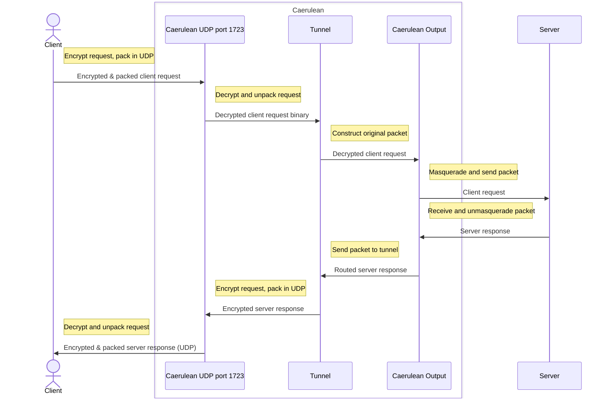

# SeasideVPN

A simple PPTP UDP VPN

> Inspired by [this](https://github.com/habibiefaried/vpn-protocol-udp-pptp) project and tutorial.

My first program in `Go`, written with assistance of multiple tutorials and ChatGPT.

Run using following command:

```bash
docker-compose -f test/docker-compose.yml up --force-recreate --build
```

## Caerulean

Time diagram:


