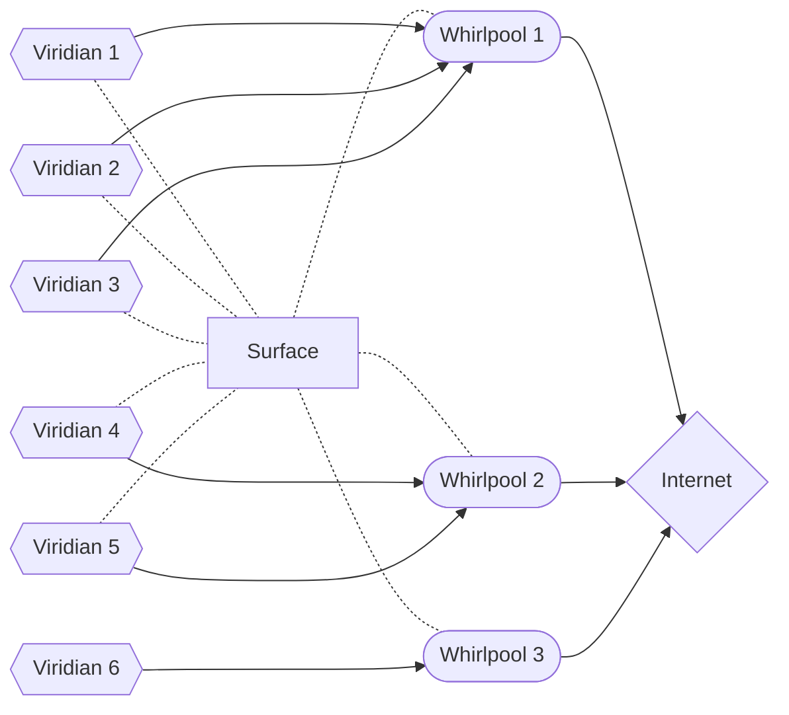

# SeasideVPN


[](https://github.com/pseusys/SeasideVPN/actions/workflows/build.yml)
[](https://github.com/pseusys/SeasideVPN/actions/workflows/test.yml)
[](https://github.com/pseusys/SeasideVPN/actions/workflows/lint.yml)

A simple PPTP UDP VPN system, focused on undetectability.
It attempts to redefine the traditional approach used by most of the wide-spread VPN systems - for better.

> Current project version: **"0.0.3"**

## General info

Here are few things that make Seaside VPN unique, fast and secure:

1. Seaside VPN operates on transport network level, being able to control the traffic on IP packet level.
   This allows simple and fast algorithms for packet processing.
2. When possible, Seaside VPN relies on kernel technologies, that are fast and well-tested.
   Relying on system built-in solutions to complex problems (such as packet masquerading or fragmentation) makes Seaside VPN code base slim and efficient.
3. Seaside VPN defines a few original transport-layer protocols that are focused on data transfer encryption, obfuscation and speed.
   All the VPN packets have no headers, contain random length tail bytes and are exchanged at random time intervals.
   This makes it harder to detect the VPN traffic.
4. Seaside VPN has no centralized infrastructure (servers, IP addresses, etc.) that means that detecting and blocking a single VPN node will never bring the whole system down.

Target users of the system are **groups** of people (companies, communities, etc.), residing in different countries and wishing to create their own VPN network.
System deployment and integration is designed to be easy even for not very familiar with networking people, so that each system instance will consist of several connected individually managed nodes.

### System structure

Below, you can see the system structure.
Following naming is used:

- [`Seaside Network`](#system-structure) is one instance of Seaside VPN system, managed and used by a group of people.
  It consists of several server nodes and client apps connected to it.
  Each seaside network can have its own entry requirements, subscription conditions, prices, etc.
- [`Surface`](#surface) is the main node of the system instance (also called the network center).
  It keeps track of actual worker nodes, collects statistics, performs load-balancing and user distribution.
  It also manages user authentication and payments, distributes incomes among VPN node owners.
  Basically, the owner of the `surface` node owns (and is responsible) for the whole network.
- [`Whirlpool`](#whirlpool) is a worker node.
  It allows user traffic forwarding, encryption, etc.
  Several `whirlpool` nodes in different locations and of different performance can be included into a single network.
  In order to make the system truly P2P, all network users are encouraged to manage their own `whirlpool` node and though contribute to the system.
- [`Viridian`](#viridian-client) is a user application (desktop, mobile, etc.).
  One `viridian` can be connected to one Seaside network at a time, but is allowed to choose between different `whirlpools` in it.



In this diagram, an example Seaside network is shown.
Three `viridians` are connected to the internet via `whirlpool` №1 and two other `viridians` via `whirlpool` №2.
All of them are also connected to `surface` node.
The last `viridian` №6 is connected only to `whirlpool` №3 and not to `surface` node, (that is only e.g. if `viridian` №6 is the administrator of `whirlpool` №3).

### Conventions

All the system parts (normally) have word "seaside" in their name to distinguish them from any other unrelated programs.
Each part also has a unique code name, somehow related to sea topic.

Moreover, each of them has a special numeric identifier, that is the ASCII code of the first letter of its' name (capitalized).  
The numeric identification table can be found below:

| Program Name | Number ID |
| --- | :-: |
| Caerulean Whirlpool | 87 |
| Viridian Algae | 65 |
| Viridian Reef | 82 |
| Seaside VPN | 83 |

### Repository structure

This repository contains **all** Seaside VPN components and parts.
That's what you can find inside:

- `.github`: Resources used by GitHub Actions CI/CD.
  - `scripts`: Automatization scripts.
  - `workflows`: GitHub actions workflows.
- `caerulean`: Caerulean system components (see [README](./caerulean/README.md)).
  - `whirlpool`: Caerulean whirlpool node (see [README](./caerulean/whirlpool/README.md)).
- `vessels`: Protobuf schemas used in various protocols.
- `view`: Project branding, images, etc.
- `viridian`: Viridian system components (see [README](./viridian/README.md)).
  - `algae`: Viridian algae node (see [README](./viridian/algae/README.md)).
  - `reef`: Viridian reef node (see [README](./viridian/reef/README.md)).

## System distribution

Normally, every VPN provider creates and manages their own VPN infrastructure, including server and client apps, sometimes even encryption and protocols, that might or might not be based on widely-known VPN standards, like [OpenVPN](https://openvpn.net/).
Still, major parts of their ecosystems are proprietary and in most cases client apps for different VPN providers work differently and are not interchangeable.

This is what makes Seaside VPN different: it provides all the VPN infrastructure ready and easy to use, so that everyone who wants could easily become a VPN provider.
It can be done in a few simple steps, including server rental and central and worker nodes deployment.
This allows multiple use cases, such as:

- Commercial VPNs, where all the nodes are owned and managed by one company (just like in all the other VPNs available online).
- Corporate VPNs, where a few worker nodes provide access to the internal corporate network for the remote employees outside.
- Community VPNs, where each worker node is hosted by a separate person, and they all work together to provide VPN for a group chat, for instance.
- Private VPNs, where one person sets up a VPN for themselves (and maybe a few other people) abroad, for personal usage.

Some of these networks might require fiat or cryptocurrency payment for subscription, the others might be free for use or community-funded.
For all these types of networks, a single client app can be used, because all of them are based on the same platform and the same set of protocols.
That allows easily switching between networks in case some of them are unavailable or suddenly blocked.

> **NB!** As no global infrastructure (i.e. public servers, domain names, etc.) is planned, user privacy and safety solely depends on the each system instance _node operators_, somewhat like in [TOR](https://www.torproject.org/) network, but with one hop only.
> System can only exist and be active until the people that use it **trust each other**! 🤝

## Data, connections and protocols

The key difference of Seaside VPN from other VPN systems is it's undetectability.
Indeed, according to several articles ([this](https://ieeexplore.ieee.org/document/8275301), [this](https://www.ir.com/guides/deep-packet-inspection) or [this](https://www.sciencedirect.com/science/article/abs/pii/S0167404813000837)), packet analysis is done according to several techniques:

- Packet header analysis.
- Packet content analysis.
- Packet exchange time analysis.

Seaside VPN offers several ways to handle all these cases:

1. All VPN and control packets are encrypted and don't have any unencrypted header.
2. Control packet lengths are randomized with random length tail.
3. Control packets (healthcheck) sending time is random.
4. VPN packets sending via several "gateway" servers with different IPs (coming soon!).

The unique Seaside protocols are defined specifically for this use case:

- [`TYPHOON`](./viridian/algae/typhoon/typhoon.ipynb) is the primary protocol [created from scratch](./viridian/algae/typhoon/README.md) for Seaside VPN, it is the most secure and fast, but also the most complex one.
- [`PORT`](./viridian/algae/typhoon/port.ipynb) is the fallback protocol attempting to repeat as much `TYPHOON` features as possible using built-in `TCP` settings, it is less secure and efficient, but more reliable and simple.

## Connection certificate

Even though SeasideVPN has a defined gRPC API, it is designed so that the **most basic** connection scenario is available being **100% encrypted** and without relying on any known API queries.
That can be done using a special **connection certificate**.
Having this certificate is absolutely necessary to connect to a Seaside VPN node, so without having this certificate it's impossible to say whether a node is available on the given IP address or not.

> NB! Different types of connection certificates are available for different Seaside VPN nodes, but only the `whirlpool` certificate allows no-gRPC access.
> The other certificate formats are described in appropriate [caerulean documentation](./caerulean/README.md).

**Connection certificate** is defined in [`SeasideConnectionClientCertificate` message](./vessels/common.proto):

- **nodetype**: type of node the certificate describes, for worker nodes it is `whirlpool`.
- **address**: (IP or domain name) where the node server is hosted.
- **public**: a 32-byte Base64-encoded node public key.
- **token**: a special encrypted token containing user information, Base64-encoded.
- **port**: port number for connection by PORT protocol.
- **typhoon**: port number for connection by TYPHOON protocol.
- **dns**: an IP address of the DNS server proposed by the server.

Connection certificate is a secret Seaside network address and should be shared via a third-party channel (e.g. email, messengers, printed, etc.).

> NB! In case of non-digital connection certificate transmission, QR-code usage is advised.

After all, the connection certificate can be expressed in a form of an URL:

```text
seaside+{nodetype}://{address}?public={public}&token={token}&port={port}&typhoon={typhoon}&dns={dns}
```

> NB! Some of the nodes (the ones that can be run in Docker) usually accept the certificate in form of environmental variables.

## System parts

Below some short descriptions of different system parts are given alongside with links to their dedicated README files.

### Caerulean (server)

Caerulean is server side of Seaside VPN.
See detailed documentation [here](./caerulean/README.md).
It consists of several parts:

#### Surface

🚧 Under construction! 🚧

#### Whirlpool

> Inspired by [this](https://github.com/habibiefaried/vpn-protocol-udp-pptp) project and tutorial.

My first program in `Go`, written with assistance of multiple tutorials and ChatGPT.
See detailed documentation [here](./caerulean/whirlpool/README.md).

### Viridian (client)

Viridian is client side of Seaside VPN.
See detailed documentation [here](./viridian/README.md).
There are several client options:

#### Algae

A set of tools in `Python` written for development and integration testing purposes.
It contains:

- [`setup`](./viridian/algae/setup) package for easy caerulean deployment.
- [`sources`](./viridian/algae/sources) package with simple client implementation and API fixtures.
- [`protocol`](./viridian/algae/typhoon/) defines protocols implemented and utilized by Seaside VPN.

See detailed documentation [here](./viridian/algae/README.md).

#### Reef

A client in `Rust` written for production.
Also defines a cross-platform library that is used in other OS-specific clients.
My first program in `Rust` written after I have finished all the [rustanomicon](https://doc.rust-lang.org/nomicon/).

See detailed documentation [here](./viridian/reef/README.md).

## Usage disclaimer

Before exploring Seaside VPN code and use cases, please make sure you read and completely understood the following statement:

> Everyone who ever participated in Seaside VPN creation, development and testing DOES respect the supremacy of laws and other legal obligations.
> Seaside VPN is neither designed, nor intended for any usage that violates any local rules and legislation.
> Please, do not under any circumstances use any part of this code for any criminal activity.
> The whole Seaside VPN project was started as a research attempt, and so it should stay.
> None of the potentially dangerous usage of this technology is encouraged and will be supported, and thus Seaside VPN developers should not be accountable for any legal damage it could cause.

## General launching commands

Commands for all projects testing and linting are defined in root `Makefile`.
These are the most important of them:

- ```bash
  make help
  ```

  for receiving the list of available `make` commands with detailed descriptions.

- ```bash
  make test
  ```

  for testing all system components.

- ```bash
  make lint
  ```

  for linting all system components.

- ```bash
  make clean
  ```

  for cleaning all building artifacts and Docker containers/images/networks.

  > NB! Several tools are required for the `make` command execution.
  > They include but might not be limited to the following:
  > - [`make`](https://www.gnu.org/software/make/) and [`bash`](https://www.gnu.org/software/bash/) for shell scripts execution.
  > - [`shellcheck`](https://github.com/koalaman/shellcheck) for `shell` scripts linting.
  > - [`markdownlint`](https://github.com/igorshubovych/markdownlint-cli) for `markdown` files linting.
  > - [`codespell`](`https://github.com/codespell-project/codespell`) for all the text files spelling checking.
  > - Dependencies for `algae` running, testing and linting are listed in the [dedicated README](./viridian/algae/README.md#dependencies).
  > - Dependencies for `whirlpool` code generation and running are listed in the [dedicated README](./caerulean/whirlpool/README.md#dependencies).
  > - [`NodeJS18+`](https://nodejs.org/en) for scripts (in `./github/scripts`) execution.

## Future development

The steps of expected system development and not-yet-implemented features are described below.

### Connection short descriptions

Whirlpool to Surface connection:

1. Whirlpool applies for connection, suggests the fee.
2. Surface refuses OR server proposes a new fee OR server registers payment contract on blockchain + approves.
3. Whirlpool sends another application OR checks blockchain data over the LATEST request and sends connection info.

Proxy to Surface connection:

1. Proxy applies.
2. Surface approves.
3. Upon assignment, surface sends update to proxy first, to whirlpool later.

### Roadmap

- `viridian/reef`: Rust CLI and GUI crate viridian client and router app for Linux.
- `caerulean/foam`: Proxy for whirlpool.
- `caerulean/breeze`: User authentication backend.
- `viridian/...`: Windows GUI client (by [this](https://github.com/microsoft/UwpVpnPluginSample) example).
- `viridian/...`: Apple (MacOS + iOS) GUI client (by [this](https://kean.blog/post/vpn-configuration-manager) example).
- `viridian/...`: Android (Kotlin + SDK) GUI client (by [this](https://developer.android.com/reference/android/net/VpnService) example).
- `caerulean/surface`: Linux distributed node manager (java + springboot + thymeleaf).
- `...`: TRON API smart contract for payments.
- `caerulean/...`: Web `caerulean` explorer - pulls info from TRON, displays public servers, allows QR codes generation (static + github hosting + TypeScript + React/Angular).

### TODOs

1. Check tests without 0.0.0.0 iptables rule(s).
2. Rename all "user" and "client" to viridian (for consistency).
3. Publish notebooks (for future publication?).
4. Revise python protocols, fix random bugs, add error synchronization.
5. Remove plugins from `poetry install` calls, add `requires-plugin` section.
6. Protocol simulation: UDP tracker, BitTorrent, QUIC, etc.

### Further considerations

- Addresses for VPN connection: black and white list (limit addresses to use VPN with) <- add traffic analysis tool to client.
- Control healthcheck times by cosine function, increase max delay to smth like 360 seconds, add random response delay.
- Advice on traffic distribution (proxy nodes), all routes and ports masking, on caerulean side: switch to 172.x.x.x tunnel IP, 1st X will be the number of PROXY the packet has been received from (each proxy has its own port map, viridian also dedicates a separate port for each proxy).
- Add RTP protocol disguise option (to obfuscation, sent by client).
- Use Captcha for user registrations.
- Track [GitHub issue](https://github.com/ldx/python-iptables/pull/340) for viridian algae warnings removal.
- Add different cipher options (XChaCha20-Poly1305, AES-256-GCM, etc.).
- Implement No-TLS solution (for stricter blocking).
- Create an installation configuration whirlpool + proxy on the same host.
- Create CONTRIBUTING.md and USING.md tutorials.
- Fix release artiface algorithm: add different installation scripts **only** (whirlpool-standalone, whirlpool-foam, whirlpool-surface (with compose.yml), ...).

## Similar projects

- [Claimed-to-be undetectable VPN](https://github.com/vpnhood/VpnHood)
- [Simple Golang VPN](https://github.com/skx/simple-vpn)
- [Hidden VPN](https://github.com/bigeagle/gohop) and [article about it](https://www.researchgate.net/publication/269310871_GoHop_Personal_VPN_to_defend_from_censorship)
