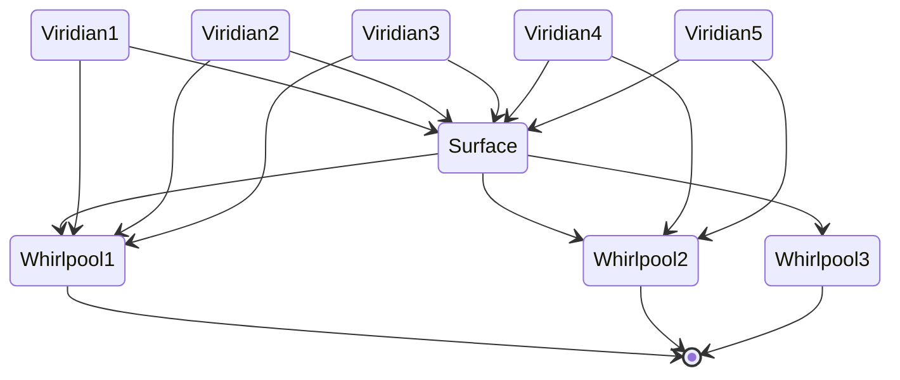
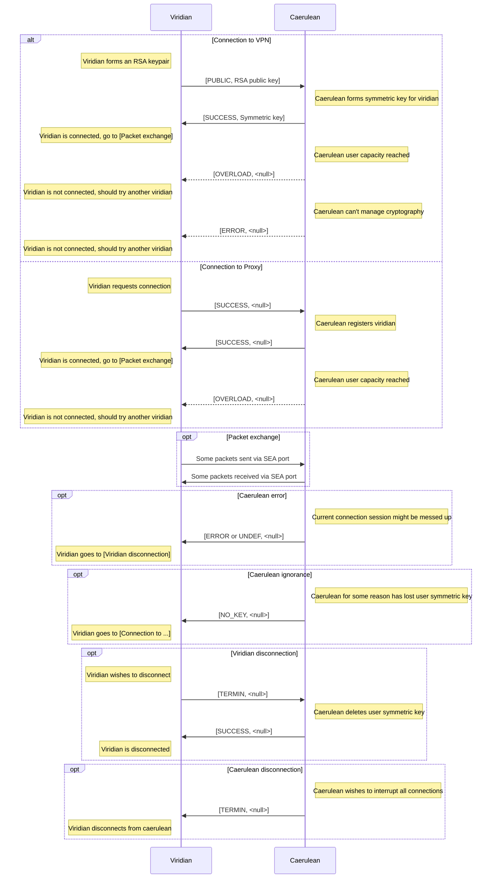

# SeasideVPN

A simple PPTP UDP Proxy and VPN system

> Inspired by [this](https://github.com/habibiefaried/vpn-protocol-udp-pptp) project and tutorial.

My first program in `Go`, written with assistance of multiple tutorials and ChatGPT.

## General info

Seaside is a VPN and Proxy distributed system, focused on making final user traffic not easily detectable so that the whole system access blocking becomes not cost-effective.

For user traffic encryption in VPN mode `XChaCha20-Poly1305` and `RSA2048` hybrid encryption is used.
For protocol obfuscation special [`wavy messages`](#wavy-messages) protocol is used.

Target users of the system are **groups** of people (companies, communities, etc.), residing in different countries and wishing to create their own VPN network.
System deployment and integration is (planned) to be easy even for not very familiar with networking people, so each system instance will consist of several connected individually managed nodes.

> **NB!** As no global infrastructure (i.e. public servers, domen names, etc.) is planned, user privacy and safety solely depends on the each system instance _node operators_.
> System can only exist and be active until the people that use it **trust each other**! 🤝

### System structure

Below, you can see the (planned) system structure.
Following naming is used:

- [`Surface`](#surface) is the main node of the system instance.
  It keeps track of actual gateway worker nodes, collects statistics, performs load-balancing and user distribution.
  Basically, the owner of the `surface` node owns (and is responsible) for the whole system instance.
- [`Whirlpool`](#whirlpool) is a worker node.
  It allows user traffic forwarding (VPN or Proxy), encryption, etc.
  Several `whirlpool` nodes in different locations and of different performance can be included into a single system instance.
  In order to make the ssytem truly P2P, all system instance users are encouraged to manage their own `whirlpool` node and though contribute to the system.
- [`Viridian`](#viridian-client) is a user application (desctop, mobile, browser, etc.).
  One `viridian` can be connected to one seaside system instance at a time, but is allowed to choose between different `whirlpool`s in it.



Here, you can see, three users connected to internet (marked by `*` this character) via `whirlpool` №1 and two other users via `whirlpool` №2.

### Conventions

The number of important parameters define the system.
They define IP addresses, port numbers, names, etc.  
The parameters can be found in the table below:

| Parameter Name | Parameter Value |
| --- | --- |
| Seaside UDP port | 8542 |
| Control TCP port | 8543 |
| Caerulean tunnel network | 192.168.0.87/24 |
| Tunnel MTU | 1500 |
| Transmission packet buffer | 2000 |

Each program here has a special numeric identifier, that is the ASCII code of the first letter of its' name (capitalized).  
The numeric identification table can be found below:

| Program Name | Numeric Identifier |
| --- | --- |
| Caerulean Whirlpool | 87 |
| Viridian Algae | 65 |
| Seaside VPN | 83 |

Every application supports at least 4 logging levels: `DEBUG`, `INFO`, `WARNING` and `ERROR` (and some of them even more!).
They should be specified with environmental variable `LOG_LEVEL`.

There are some important notes and conditions that must be fulfilled in order for system to work as expected:

- Viridian packet must have client external IP (not a tunnel IP) as source IP.

## Data, connections and protocols

Packets, forwarded via "seaside port" (encrypted or not) are just raw data packed into UDP packets,
no headers, states or protocols are used.

It makes packets forwarded via SeasideVPN indifferent from all the other packets sent across internet,
so it becomes not as easy to distinguish and block them.

Packets sent to "control port" control viridian to caerulean connection (connected user number, passwords, etc.).

These packets use special "control protocol" (described [later in this section](#viridian-to-whirlpool-connection)).
Moreover, they are obfuscated with special "wavy protocol" (described [right below](#wavy-messages)).

### Wavy messages

Many messages have the same size (1 byte) and a limited amount of status codes.
That makes system potentionally voulnerable to distinguishing and blocking.

In order to prevent this, all the messages are "waved" and
instead of the original message, the following structure is sent:

| Random (gravity) bytes | Data pointer | Random (prefix) bytes | Status | Data length | Data | Random (postfix) bytes
| --- | --- | --- | --- | --- | --- | --- |
| 5 bytes | 1 byte | (random) | 1 byte | 2 bytes | (defined) | (random) |

> Total message length: not more than 65536

### Viridian to whirlpool connection



Here optional messages are shown in dotted lines.

> **NB!** Although the protocol is stateful, the current stateis not really important:
> viridian can re-connect to caerulean in _any_ mode _any_ time it wants!

## Caerulean (server)

Caerulean is server side of Seaside VPN, it consists of several parts:

### Surface

🚧 Under construction! 🚧

### Whirlpool

See detailed documentation [here](https://github.com/pseusys/SeasideVPN/blob/main/caerulean/whirlpool/README.md).

## Viridian (client)

Viridian is client side of Seaside VPN, there are several client options:

### Algae

See detailed documentation [here](https://github.com/pseusys/SeasideVPN/blob/main/viridian/algae/README.md).

## General launching commands

Commands for all projects testing and linting are defined in root `Makefile`.
These are:

- ```bash
  make test
  ```

  for testing all system components, including integration tests.

- ```bash
  make lint
  ```

  for linting all system components.

## Future development

### Roadmap

- `caerulean/surface` - distributed node manager
- `viridian/...` - google chrome (and other browser) extension
- `viridian/...` - windows and linux GUI client ([wintun](https://git.zx2c4.com/wintun/about/) + [qt](https://www.qt.io/))
- `viridian/...` - android / ios clients

### TODOs

1. Add unit tests to both `caerulean/whirlpool` and `viridian/algae` (do not run them in Docker).
2. Write documentation for both `caerulean/whirlpool` and `viridian/algae`.
3. Add further integration tests - connection, disconnection, errors.
4. Remove all `(planned)` marks from READMEs.
5. Add shell build, generation, etc. script for easy `caerulean/whirlpool` deployment (with and without container).
6. Add general make script to check dependencies, environment, etc.

### Considerations

1. Use a library for `iptables` management in `caerulean/whirlpool` - if some other types of operations (not adding) are required; same about `ip route` and regex in `sources/console.go`.
   If so, consider also environment restoration in the end of main in `main.go`.

### Current goals

- All done for now!
