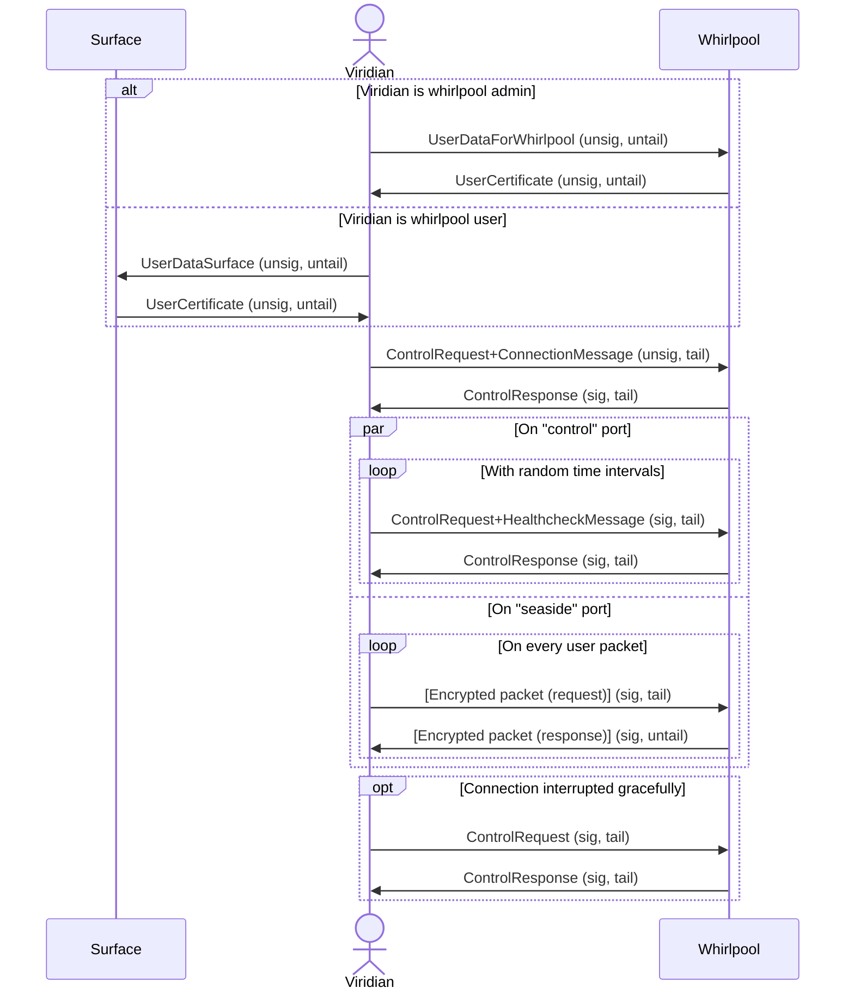

# SeasideVPN

A simple PPTP UDP and VPN system

> Inspired by [this](https://github.com/habibiefaried/vpn-protocol-udp-pptp) project and tutorial.

My first program in `Go`, written with assistance of multiple tutorials and ChatGPT.

## General info

Seaside is a VPN and distributed system, focused on making final user traffic not easily detectable so that the whole system access blocking becomes not cost-effective.

For user traffic encryption `XChaCha20-Poly1305` encryption is used.
For protocol obfuscation special [`wavy messages`](#wavy-messages) protocol is used.

Target users of the system are **groups** of people (companies, communities, etc.), residing in different countries and wishing to create their own VPN network.
System deployment and integration is designed to be easy even for not very familiar with networking people, so that each system instance will consist of several connected individually managed nodes.

> **NB!** As no global infrastructure (i.e. public servers, domen names, etc.) is planned, user privacy and safety solely depends on the each system instance _node operators_.
> System can only exist and be active until the people that use it **trust each other**! 🤝

### System structure

Below, you can see the system structure.
Following naming is used:

- [`Surface`](#surface) is the main node of the system instance.
  It keeps track of actual worker nodes, collects statistics, performs load-balancing and user distribution.
  It also manages user authentication and payments, distributes incomes among VPN node owners.
  Basically, the owner of the `surface` node owns (and is responsible) for the whole system instance.
- [`Whirlpool`](#whirlpool) is a worker node.
  It allows user traffic forwarding, encryption, etc.
  Several `whirlpool` nodes in different locations and of different performance can be included into a single system instance.
  In order to make the sytem truly P2P, all system instance users are encouraged to manage their own `whirlpool` node and though contribute to the system.
- [`Viridian`](#viridian-client) is a user application (desctop, mobile, browser, etc.).
  One `viridian` can be connected to one seaside system instance at a time, but is allowed to choose between different `whirlpool`s in it.


On this diagram, an example SeaSide system is shown.
Three `viridian`s are connected to internet via `whirlpool` №1 and two other `viridian`s via `whirlpool` №2.
All of them are also connected to `surface` node.
The last `viridian` №6 is connected only to `whirlpool` №3 and not to `surface` node, that is only possible if `viridian` №6 is the administrator of `whirlpool` №3.

### Conventions

Each program here has a special numeric identifier, that is the ASCII code of the first letter of its' name (capitalized).  
The numeric identification table can be found below:

| Program Name | Numeric Identifier |
| --- | --- |
| Caerulean Whirlpool | 87 |
| Viridian Algae | 65 |
| Seaside VPN | 83 |

There are some important notes and conditions that must be fulfilled in order for system to work as expected:

- Viridian packets must not exceed 65495 bytes (that is max UDP packet size minus overflow for encryption).

## Data, connections and protocols

The key difference of SeaSide VPN from other VPN systems is it's undetectability.
Indeed, according to several articles ([this](https://ieeexplore.ieee.org/document/8275301), [this](https://www.ir.com/guides/deep-packet-inspection) or [this](https://www.sciencedirect.com/science/article/abs/pii/S0167404813000837)), packet analysis is done according to several techniques:

- Packet header analysis.
- Packet content analysis.
- Packet exchange time analysis.

SeaSide VPN offers several ways to handle all these cases:

1. All VPN and control packets are encrypted and don't have any unencrypted header.
2. Control packet lengths are randomized with random length tail.
3. Control packets (healthcheck) sending time is random.

Following ways are yet to be implemented:

1. VPN packets sending via several "gateway" servers with different IPs, simulating `BitTorrent` protocol.
2. All ports and endpoint names are randomized.

The typical packet structure corresponds to special "wavy protocol" (described [right below](#wavy-messages)).
The only way to decrypt a packet is guessing `XChaCha20-Poly1305` key (32 bytes).
The only way to prove two messages use "wavy protocol" and belong to one user is either becoming a client of the same system as the user or intercepting 2 packets and guessing packet signature multiplier (8 bytes).

### Wavy messages

All the raw IP packets sent and received by the system (except for initial data exchange packets) have the following structure:

| Addition | Signature | Payload | Tail |
| --- | --- | --- | --- |
| 8 bytes | 8 bytes | (random) | (random) |

Packets can be `signed` and `unsigned`, `tailed` and `untailed`.
In order to encrypt the message, two 8-byte integers are required: `multiplier` and `zero_user_id`.
One important number is `max_prime` prime number, that is equal to $2^{64} - 59$.
For every packet, `addition` is a random number.

User ID is a 2-byte integer.
If packet is signed, `signature` can be calculated:

```math
((multiplier \cdot ((user\_id + zero\_user\_id) \bmod max\_prime)) + addition) \bmod max\_prime
```

For calculation of user ID having `signature` and `addition`, the following value is required: `unmultiplier`, that is modular multiplicative inverse of `multiplier`.
User ID can be calculated:

```math
(((unmultiplier \cdot (signature - addition)) \bmod max\_prime) - zero\_user\_id + max\_prime) \bmod max\_prime
```

Tail is expected only for control messages (because they usually have equal length that can be detected).
A special function has to be defined for tail length calculation: `bit_count`, that maps 64-bit integers to numbers of `1` in their binary representation.
Tail length can be calculated:

```math
bit\_count(zero\_user\_id \oplus addition) \bmod 64
```

> NB! For `XChaCha20-Poly1305` cipher, `addition` and `signature` bytes are included into nonce.

### Viridian to whirlpool connection



On this diagram, a typical correct VPN connection is shown.
For every message, `sig`/`unsig` means that the message is expected to be `signed`/`unsigned` and `tail`/`untail` means that the message is expected to be `tailed`/`untailed`.
All the messages are expected to be exchanged on `control` port (unless specified).
Message names reflect corresponding `protobuf` object names (see [message descriptions](./vessels/)).

During connection, after some initial HTTP requests, two ports are used:

1. "Control Port": TCP port for control message exchange.
2. "Sea Port": UDP port for VPN data packets exchange.

After the initial control message exchange is done, control port is used for healthcheck message exchange.
Healthcheck control messages are sent at random time intervals, losing several healthcheck messages in a row leads to user disconnection.

> **NB!** Although the protocol is stateful, the current state is not really important:
> viridian can re-connect to caerulean _any_ time it wants!

## Connection certificate

Connection to all seaside system nodes can be done using a special **connection certificate** only.
If it wouldn't be the case, at least some system nodes should've provided some public interface for user connections (e.g. sending unencrypted public key on request or showing login page).
That could've potentially compromise the system and provide an intruder a way to automatically create an account or login and receive necessary information for efficient packet signature resolution.

**Connection certificate** for all the nodes have common structure:

- **nodetype**: type of node the certificate describes.
- **address**: (IP or domain name) where the node HTTP server is hosted.
- **netport**: port number where the node HTTP server is hosted.
- **anchor**: endpoint name, sending a request to this endpoint will initiate login sequence.
- **public**: `XChaCha20-Poly1305` key (hex string), 32 bytes long.
- **payload**: string for user type determination and **public** encryption checking.

Each node can support multiple **payload** options, e.g. for users with differen privelege levels or for users from different origins.
All the connection certificate can be expressed in a form of an URL:

```text
seaside+{nodetype}://{address}:{netport}/{anchor}?public={public}&payload={owner}
```

> NB! Some of the nodes (the ones that can be run in Docker) usually accept the certificate in form of environmental variables.
> In that case, the certificate field names are ptepended with `seaside_` prefix in order to avoid potential clashes with other variables.

## System parts

Below some short descriptions of different system parts are given alongside with links to their dedicated README files.

### Caerulean (server)

Caerulean is server side of Seaside VPN, it consists of several parts:

#### Surface

🚧 Under construction! 🚧

#### Whirlpool

See detailed documentation [here](./caerulean/whirlpool/README.md).

### Viridian (client)

Viridian is client side of Seaside VPN, there are several client options:

#### Algae

See detailed documentation [here](./viridian/algae/README.md).

## General launching commands

Commands for all projects testing and linting are defined in root `Makefile`.
These are:

- ```bash
  make test
  ```

  for testing all system components.

- ```bash
  make lint
  ```

  for linting all system components.

- ```bash
  make clean
  ```

  for cleaning all building artifacts and Docker containers/images/networks.

## Future development

### Roadmap

- descriptions + tests for `whirlpool` and `algae`
- `viridian/...` - windows and linux GUI client ([wintun](https://git.zx2c4.com/wintun/about/) + rust + electron)
- `caerulean/surface` - distributed node manager
- `viridian/...` - android / ios clients

### TODOs

1. Add unit tests for `viridian/algae`.
2. Write documentation for both `caerulean/whirlpool` and `viridian/algae`.
3. Add shell build, generation, etc. script for easy `caerulean/whirlpool` deployment (with and without container).
4. Add "stress" profile with pumba on internal router for enhanced testing, use tcp echo server (can be found on dockerhub) (4 containrrs, no ext router).
5. Add "load" profile for direct access (3 containers) and multiple clients and performance analysis for whirlpool.
6. Write script for downloading/running/configuring server
7. Control healthcheck times by cosine function, increase max delay to smth like 360 seconds, add random response delay
8. Addresses for VPN connection: black and white list (limit addresses to use VPN with) <- add traffic analysis tool to client
9. Advice on traffic distribution (proxy nodes), all routes and ports masking, on caerulean side: switch to 172.x.x.x tunnel IP, 1st X will be the number of PROXY the packet has been received from
10. Add RTP protocol disguise option (to obfuscation, sent by client)
11. Reprivate tests + make tunnel methods available by dot from config
12. Comment and rewrite env files

### Further considerations

- Fix docker healthchecks when docker engine v25 is out.
