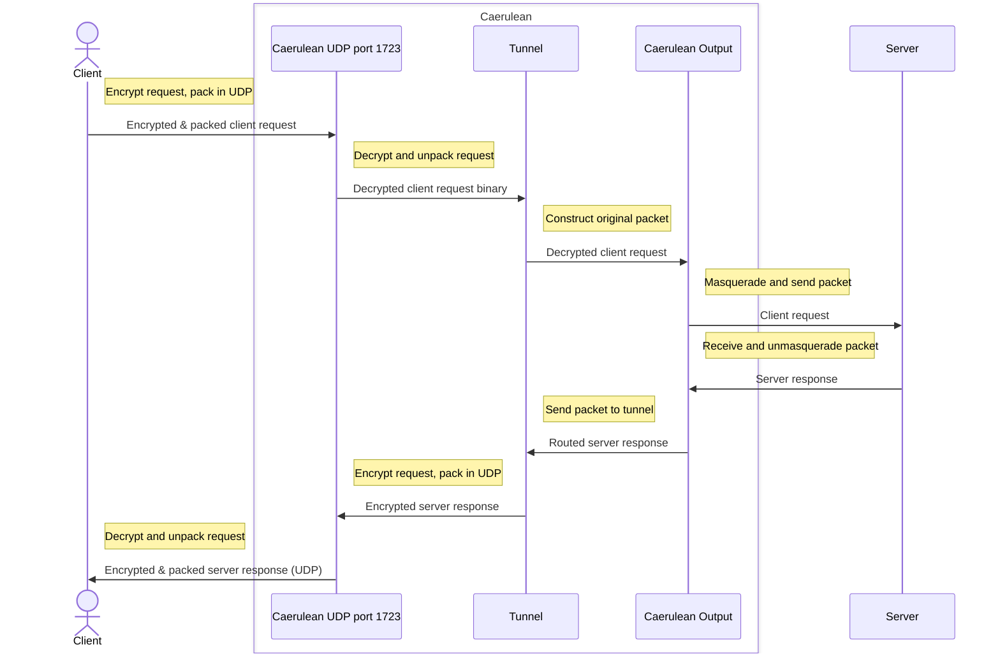

# SeasideVPN

A simple PPTP UDP VPN

> Inspired by [this](https://github.com/habibiefaried/vpn-protocol-udp-pptp) project and tutorial.

My first program in `Go`, written with assistance of multiple tutorials and ChatGPT.

Run using following command:

```bash
docker-compose -f test/docker-compose.yml up --force-recreate --build
```

## Caerulean

Caerulean is server side of SeaSide VPN, it consists of several parts:

### Surface

TODO!

### Whirlpool

Whirlpool program is written in Go language.
It manages encrypting, decrypting, assembling and transferring requests and responses.

Whirlpool accepts client packages at UDP port 1723, no more than 32000 bytes in size, encrypted.
TODO: encryption negotiation is yet to be implemented!

> WARNING! Any UDP packets arriving to port 1723 will be treated as user packets, i.e. user should never send packets to port 1723 of any server via Seaside VPN!

#### Time diagram



#### IPTables configuration

```bash
iptables -F
iptables -A INPUT -p udp -d 'SEASIDE_IP_ADDRESS' --dport 1723 -i eth0 -j ACCEPT
iptables -P INPUT DROP
iptables -A FORWARD -i tun0 -o eth0 -j ACCEPT
iptables -A FORWARD -i eth0 -o tun0 -j ACCEPT
iptables -P FORWARD DROP
iptables -t nat -A POSTROUTING -o eth0 -j MASQUERADE
iptables -P OUTPUT ACCEPT
```
