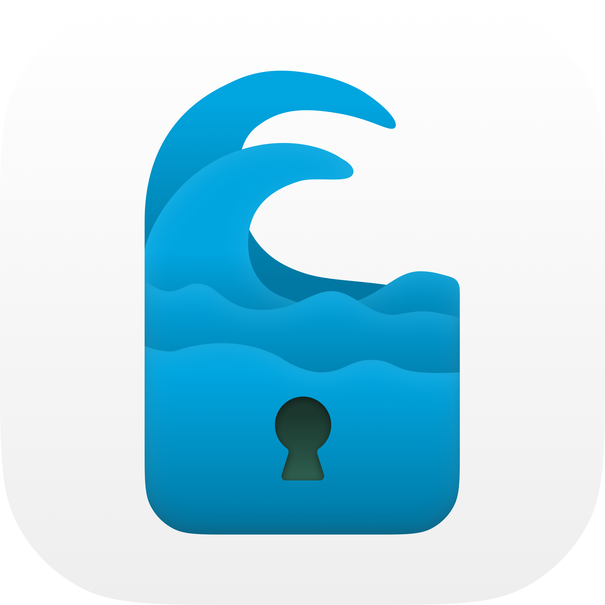

# SeasideVPN

<kbd>
  
</kbd>

[](https://github.com/pseusys/SeasideVPN/actions/workflows/test.yml)

A simple PPTP UDP and VPN system, focused on undetectability.
The system is based on a new headerless completely encrypted communication protocol.

Current project version: **"0.0.1"**

## General info

Here are few things that make Seaside VPN unique, fast and secure:

1. Seaside VPN operates on transport network level, being able to control the traffic on IP packet level. This allows simple and fast algorithms for packet processing.
2. VPN data packets in Seaside VPN contain no header at all, that makes it harder to detect the VPN traffic.
3. Seaside VPN uses encrypted gRPC channels for control packet exchange. Channels are not recreated while the connection is active.
4. Seaside VPN control packets contain random length tail metadata and are exchanged at random time intervals, making any assumptions about their nature harder.
5. Seaside VPN has no centralized infrastructure (servers, IP addresses, etc.) that means that detecting and blocking a single VPN node will never bring the whole system down.

Target users of the system are **groups** of people (companies, communities, etc.), residing in different countries and wishing to create their own VPN network.
System deployment and integration is designed to be easy even for not very familiar with networking people, so that each system instance will consist of several connected individually managed nodes.

> **NB!** As no global infrastructure (i.e. public servers, domen names, etc.) is planned, user privacy and safety solely depends on the each system instance _node operators_.
> System can only exist and be active until the people that use it **trust each other**! 🤝

### System structure

Below, you can see the system structure.
Following naming is used:

- [`Seaside Network`](#system-structure) is one instance of Seaside VPN system, managed and used by a group of people.
  It consists of several server nodes and client apps connected to it.
  Each seaside network can have its own entry requirements, subscription conditions, prices, etc.
- [`Surface`](#surface) is the main node of the system instance (also called the network center).
  It keeps track of actual worker nodes, collects statistics, performs load-balancing and user distribution.
  It also manages user authentication and payments, distributes incomes among VPN node owners.
  Basically, the owner of the `surface` node owns (and is responsible) for the whole network.
- [`Whirlpool`](#whirlpool) is a worker node.
  It allows user traffic forwarding, encryption, etc.
  Several `whirlpool` nodes in different locations and of different performance can be included into a single network.
  In order to make the sytem truly P2P, all network users are encouraged to manage their own `whirlpool` node and though contribute to the system.
- [`Viridian`](#viridian-client) is a user application (desktop, mobile, etc.).
  One `viridian` can be connected to one Seaside network at a time, but is allowed to choose between different `whirlpool`s in it.


In this diagram, an example Seaside network is shown.
Three `viridian`s are connected to the internet via `whirlpool` №1 and two other `viridian`s via `whirlpool` №2.
All of them are also connected to `surface` node.
The last `viridian` №6 is connected only to `whirlpool` №3 and not to `surface` node, (that is only e.g. if `viridian` №6 is the administrator of `whirlpool` №3).

### Conventions

Each program here has a special numeric identifier, that is the ASCII code of the first letter of its' name (capitalized).  
The numeric identification table can be found below:

| Program Name | Numeric Identifier |
| --- | :-: |
| Caerulean Whirlpool | 87 |
| Viridian Algae | 65 |
| Seaside VPN | 83 |

There are some important notes and conditions that must be fulfilled in order for system to work as expected:

- Viridian packets must not exceed 65495 bytes (that is max UDP packet size minus overflow for encryption).
- Whirlpool nodes can't maintain more than 65533 viridians (due to the whirlpool node architecture).

### Repository structure

This repository contains **all** Seaside VPN components and parts.
That's what you can find inside:

- `.github`: Resources used by GitHub Actions CD/CI.
  - `scripts`: Automatization scripts.
  - `workflows`: GitHub actions workflows.
- `caerulean`: Caerulean system components.
  - `whirlpool`: Caerulean whirlpool node (see [README](./caerulean/whirlpool/README.md)).
- `vessels`: Protobuf schemas used in various protocols.
- `view`: Project branding, images, etc.
- `viridian`: Viridian system components.
  - `algae`: Viridian algae node (see [README](./viridian/algae/README.md)).

## Data, connections and protocols

The key difference of SeaSide VPN from other VPN systems is it's undetectability.
Indeed, according to several articles ([this](https://ieeexplore.ieee.org/document/8275301), [this](https://www.ir.com/guides/deep-packet-inspection) or [this](https://www.sciencedirect.com/science/article/abs/pii/S0167404813000837)), packet analysis is done according to several techniques:

- Packet header analysis.
- Packet content analysis.
- Packet exchange time analysis.

Seaside VPN offers several ways to handle all these cases:

1. All VPN and control packets are encrypted and don't have any unencrypted header.
2. Control packet lengths are randomized with random length tail.
3. Control packets (healthcheck) sending time is random.

Following ways are yet to be implemented:

1. VPN packets sending via several "gateway" servers with different IPs, simulating [`UDP tracker`](https://en.wikipedia.org/wiki/UDP_tracker) protocol.
2. All ports and endpoint names are randomized.

An encrypted viridian packet arriving to a whirlpool is authenticated by its port destination.
I.e. alongside with a TCP gRPC contol channel a similar dedicated UDP port is assigned to every viridian and the VPN packets from that viridian should arrive to that port.

## Connection certificate

Connection to all Seaside network nodes can be done using a special **connection certificate** only.
That ensures no unauthorized access to any network internal interfaces.
Even knowing all the outgoing viridian traffic (e.g. capturing all its packets, including IP addresses and port numbers), an intruder still can't be sure it's a Seaside network and not something else.

**Connection certificate** for all the nodes have common structure:

- **nodetype**: type of node the certificate describes (`whirlpool` or `surface`).
- **address**: (IP or domain name) where the node gRPC server is hosted.
- **ctrlport**: port number where the node gRPC server is hosted.
- **payload**: a secret string, unique for this node and shared to the network users only.

Connection certificate is a secret Seaside network address and should be shared via a third-party channel (e.g. email, messengers, printed, etc.).

> NB! In case of non-digital connection certificate transmission, QR-code usage is advised.

Each node can support multiple **payload** options, e.g. for users with differen privelege levels or for users from different origins.
All the connection certificate can be expressed in a form of an URL:

```text
seaside+{nodetype}://{address}:{ctrlport}/{anchor}?public={public}&payload={payload}
```

> NB! Some of the nodes (the ones that can be run in Docker) usually accept the certificate in form of environmental variables.

## System parts

Below some short descriptions of different system parts are given alongside with links to their dedicated README files.

### Caerulean (server)

Caerulean is server side of Seaside VPN, it consists of several parts:

#### Surface

🚧 Under construction! 🚧

#### Whirlpool

> Inspired by [this](https://github.com/habibiefaried/vpn-protocol-udp-pptp) project and tutorial.

My first program in `Go`, written with assistance of multiple tutorials and ChatGPT.
See detailed documentation [here](./caerulean/whirlpool/README.md).

### Viridian (client)

Viridian is client side of Seaside VPN.
See detailed documentation [here](./viridian/README.md).
There are several client options:

#### Algae

A client in `Python` written for development and integration testing purposes.

See detailed documentation [here](./viridian/algae/README.md).

## General launching commands

Commands for all projects testing and linting are defined in root `Makefile`.
These are the most important of them:

- ```bash
  make help
  ```

  for receiving the list of available `make` commands with detailed descriptions.

- ```bash
  make test
  ```

  for testing all system components.

- ```bash
  make lint
  ```

  for linting all system components.

- ```bash
  make clean
  ```

  for cleaning all building artifacts and Docker containers/images/networks.

  > NB! Several tools are required for the `make` command execution.
  > They include but might not be limited to the following:
  > - [`make`](https://www.gnu.org/software/make/) and [`bash`](https://www.gnu.org/software/bash/) for shell scripts execution.
  > - [`shellcheck`](https://github.com/koalaman/shellcheck) for `shell` script linting.
  > - Dependencies for `algae` running, testing and linting are listed in the [dedicated README](./viridian/algae/README.md#dependencies).
  > - Dependencies for `whirlpool` code generation and running are listed in the [dedicated README](./caerulean/whirlpool/README.md#dependencies).
  > - [`NodeJS18+`](https://nodejs.org/en) for scripts (in `./github/scripts`) execution.

## Future development

## Connection short descriptions

Whirlpool to Surface connection:

1. Whirlpool applies for connection, suggests the fee.
2. Surface refuses OR server advices a new fee OR server registers payment contract on blockchain + approves.
3. Whirlpool sends another application OR checks blockchain data over the LATEST request and sends connection info.

Proxy to Surface connection:

1. Proxy applies.
2. Surface approves.
3. Upon assignment, surface sends update to proxy first, to whirlpool later.

### Roadmap

- `viridian/submerged`: Rust crate viridian client.
- `caerulean/foam`: Proxy for whirlpool.
- `viridian/...`: Windows and Linux GUI client ([wintun](https://git.zx2c4.com/wintun/about/) + `submerged` + electron).
- `viridian/...`: Android and iOS client (flutter + NDK + `submerged`).
- `caerulean/surface`: Linux distributed node manager (java + springboot + thymeleaf).
- `...`: TRON API smart contract for payments.
- `viridian/...`: Linux router app (rust + CLI).
- `caerulean/...`: Web `caerulean` explorer - pulls info from TRON, displays public servers, allows qr codes generation (static + github hosting + kotlin WEB).

### TODOs

1. Check tests without 0.0.0.0 iptables rule(s).
2. Rename all "user" and "cleint" to viridian (for consistency).
3. Fix all READMEs.

### Further considerations

- Addresses for VPN connection: black and white list (limit addresses to use VPN with) <- add traffic analysis tool to client.
- Control healthcheck times by cosine function, increase max delay to smth like 360 seconds, add random response delay.
- Advice on traffic distribution (proxy nodes), all routes and ports masking, on caerulean side: switch to 172.x.x.x tunnel IP, 1st X will be the number of PROXY the packet has been received from (each proxy has its own port map, viridian also dedicates a separate port for each proxy).
- Add RTP protocol disguise option (to obfuscation, sent by client).
- Use Captcha for user registrations.
- Track [GitHub issue](https://github.com/ldx/python-iptables/pull/340) for viridian algae warnings removal.
- Add different cipher options (XChaCha20-Poly1305, AES-256-GCM, etc.).
- Implement No-TLS solution (for countries like China).
- Create an installation configuration whirlpool + proxy on the same host.
- Create CONTRIBUTING.md and USING.md tutorials.
- Fix release artiface algorithm: add different installation scripts **only** (whirlpool-standalone, whirlpool-foam, whirlpool-surface (with compose.yml), ...).

### Similar projects

- [Claimed-to-be undetectable VPN](https://github.com/vpnhood/VpnHood)
- [Simple Golang VPN](https://github.com/skx/simple-vpn)
- [Chinese-grade VPN](https://github.com/bigeagle/gohop) and [article about it](https://www.researchgate.net/publication/269310871_GoHop_Personal_VPN_to_defend_from_censorship)
