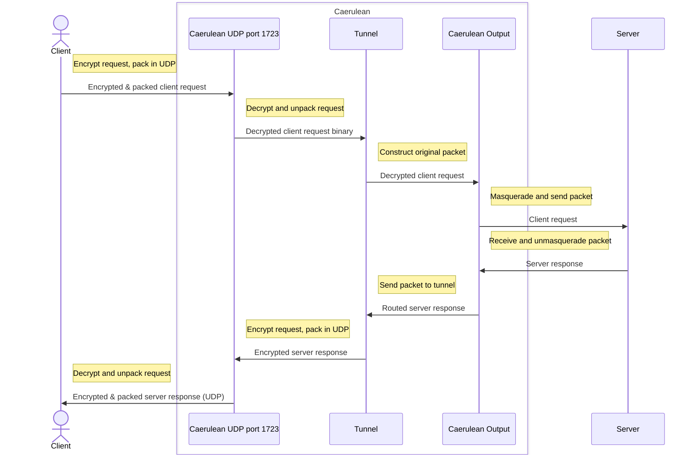

# SeasideVPN

A simple PPTP UDP VPN

> Inspired by [this](https://github.com/habibiefaried/vpn-protocol-udp-pptp) project and tutorial.

My first program in `Go`, written with assistance of multiple tutorials and ChatGPT.

Run using following command:

```bash
...
```

## Conventions

Each program here has a special numeric identifier, that is the ASCII code of the first letter of its' name (capitalized).
So far the numeric identification table looks like this:

| Program Name | Numeric Identifier |
| --- | --- |
| Caerulean Whirlpool | 87 |
| Viridian Algae | 65 |

## Caerulean

Caerulean is server side of SeaSide VPN, it consists of several parts:

### Surface

TODO!

### Whirlpool

Whirlpool program is written in Go language.
It manages encrypting, decrypting, assembling and transferring requests and responses.

Whirlpool accepts client packages at UDP port 1723, no more than 32000 bytes in size, encrypted.
TODO: encryption negotiation is yet to be implemented!

> WARNING! Any UDP packets arriving to port 1723 will be treated as user packets, i.e. user should never send packets to port 1723 of any server via Seaside VPN!

#### Time diagram



Run whirlpool cleint:

```bash
make -C caerulean/whirlpool run
```

## Viridian

Viridian is client side of SeaSide VPN, there are several client options:

### Algae

Small CLI-based client application, written in Python3.
It can be run on linux (in for- and background), highly customizable.
Created mainly for development and testing purposes.

Run algae cleint:

```bash
make -C viridian/algae run
```

## Test

```bash
docker-compose -f test/docker-compose.yml up --force-recreate --build
```

## TODOs

Algae: set tunnel IP to be the same as external
Whirlpool: send packet back to recipient
