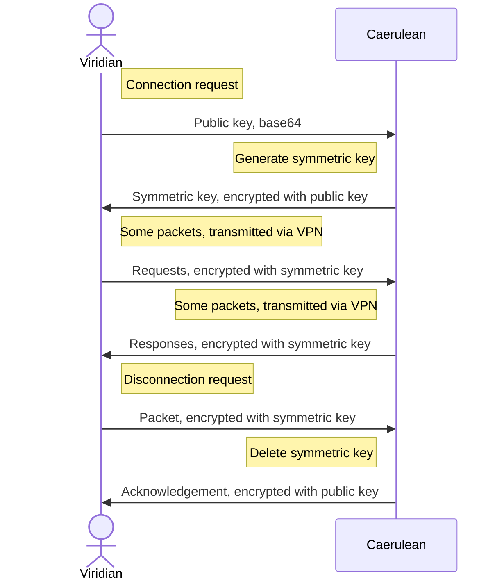
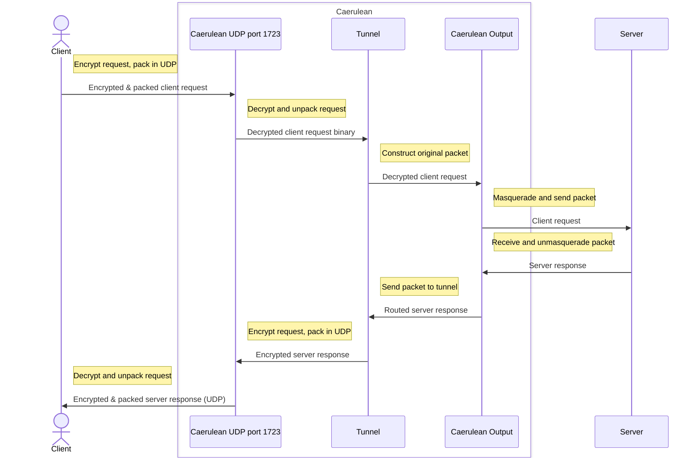

# SeasideVPN

A simple PPTP UDP Proxy and VPN system

> Inspired by [this](https://github.com/habibiefaried/vpn-protocol-udp-pptp) project and tutorial.

My first program in `Go`, written with assistance of multiple tutorials and ChatGPT.

## Conventions

The number of important parameters define the VPN system.
They define IP addresses, port numbers, names, etc.  
The parameters can be found in the table below:

| Parameter Name | Parameter Value |
| --- | --- |
| Seaside UDP port | 8542 |
| Control TCP port | 8543 |
| Caerulean tunnel network | 192.168.0.87/24 |
| Tunnel MTU | 1500 |
| Transmission packet buffer | 2000 |

Each program here has a special numeric identifier, that is the ASCII code of the first letter of its' name (capitalized).  
The numeric identification table can be found below:

| Program Name | Numeric Identifier |
| --- | --- |
| Caerulean Whirlpool | 87 |
| Viridian Algae | 65 |
| Seaside VPN | 83 |

Every application supports at least 4 logging levels: `DEBUG`, `INFO`, `WARNING` and `ERROR` (and some of them even more!).
They should be specified with environmental variable `LOG_LEVEL`.

There are some important notes and conditions that must be fulfilled in order for system to work as expected:

- Viridian packet must have client external IP as source IP and 1723 port as source port.
- ...

## Control Protocol

Some important outlines:

1. One host can not send two messages one after the other: oce it sent a message, it waits for an answer.
2. Communication is done via UDP on a separate port.



## Caerulean (server)

Caerulean is server side of Seaside VPN, it consists of several parts:

### Surface

TODO!

### Whirlpool

Whirlpool program is written in Go language.  
It manages encrypting, decrypting, assembling and transferring requests and responses.

Whirlpool accepts client packages at UDP port 8542, no more than 2000 bytes in size, encrypted.  
TODO: encryption negotiation is yet to be implemented!

Whirlpool sends messages to UDP port 1724, in packets of size 2000, encrypted.

> WARNING! Any UDP packets arriving to port 8542 will be treated as user packets, i.e. user should never send packets to port 8542 of any server via Seaside VPN!

Test whirlpool server (with algae client):

```bash
make test-caerulean-whirlpool
```

#### Run whirlpool server

> Required packages: `iptables`, `ip`

Run whirlpool server:

```bash
make -C caerulean/whirlpool run
```

Lint and format golang files:

```bash
make -C caerulean/whirlpool lint
```

Restore `iptables` configuration after run:

```bash
make -C caerulean/whirlpool restore
```

Clean build artifacts:

```bash
make -C caerulean/whirlpool clean
```

#### Time diagram



## Viridian (client)

Viridian is client side of Seaside VPN, there are several client options:

### Algae

Small CLI-based client application, written in Python3.
It can be run on linux (in for- and background), it's highly customizable.
Created mainly for development and testing purposes.

#### Run algae client

> Required packages: `ip`

Run algae client (superuser permissions required):

```bash
make -C viridian/algae run
```

Build standalone executable (OS-specific):

```bash
make -C viridian/algae build
```

Clean build artifacts:

```bash
make -C viridian/algae clean
```

## Turquoise (test)

```bash
make test
```

## TODOs

1. Add run options to all run configurations, Makefiles, split READMEs
2. Add CONTRIBUTING with rules, e.g. branch names with '-'
3. Compile Go with optimizations
4. Goroutines for server functions
5. Use [wintun](https://git.zx2c4.com/wintun/about/) for windows client?
6. Fix TODOs
7. Setup initial message offset
8. Add proper READMEs to subfolders
