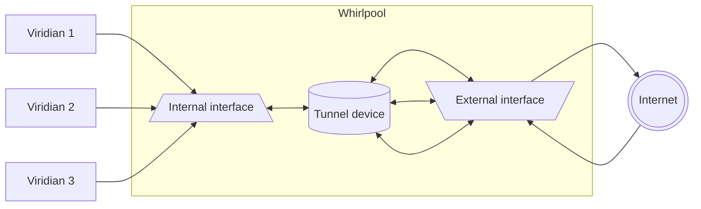

# Caerulean Whirlpool

> Current version: **"0.0.4"**

Whirlpool is "worker" Seaside server node.
It is written in `Go`.
It manages processing, encrypting and transferring VPN packets.
It doesn't manage payments and authentication.

> Target platform: _linux_ only

## Dependencies

1. `go` (compiler) version >= 1.22
  Installation guide can be found [here](https://go.dev/doc/install).
2. `flatc` (`flatbuffers` compiler) version >= 2.0.8
  Regularly can be downloaded from the [latest release](https://github.com/google/flatbuffers/releases/latest).
3. System packages: `nftables`.

## Whirlpool structure

Whirlpool consists of several modules:

- `crypto`: Is responsible for all ciphers, encryption and decryption.
- `generated`: Generated by gRPC, consists of flatbuffers structures and gRPC server interfaces.
- `protocol`: Contains seaside protocol implementations.
- `sources`: Contains main file and the most high-level server structures and functions.
- `tunnel`: Manages firewall and tunnel device configuration, setup and teardown.
- `users`: Contains viridian and viridian dictionary structures, manages viridian properties and connections.
- `utils`: Consists of utility functions.

## Implementation details

The VPN worker node operates as follows:

1. It creates a [private network](https://en.wikipedia.org/wiki/Private_network) with default address set to "\*.\*.0.1/16".
2. It creates a tunnel device connected to that network with IP equal to the default IP.
3. It sets up firewall policy as follows:
   1. All the local packets are allowed.
   2. All the existing connections are allowed, all SSH connections are allowed.
   3. All UDP packets going to **internal** interface are allowed.
   4. All TCP packets going to **internal** interface to API port are allowed.
   5. All ICMP packets going to **internal** interface are allowed.
   6. All the initialization packets going to **internal** interface to protocol-specific ports are allowed.
   7. All the other incoming packets are dropped.
   8. Forwarding is only allowed between tunnel interface and **external** interface.
   9. All packets leaving from **external** interface are sent to `MASQUERADE`.
4. It opens gRPC control server on its **internal** interface and waits for users to connect.
5. It starts all the protocol-specific listeners.
6. It also starts listening to the tunnel device: as soon as a packet arrives to it, it gets encrypted and sent to the viridian identified by _the last two bytes_ of the packet source IP.
7. When a viridian connects, a special UDP port assigned to it on **internal** interface, viridian data is added to viridian dictionary identified by this port number and a UDP listener is assigned to this port.
8. When viridian sends encrypted VPN packets to his own port, whirlpool receives them, decrypts, and sets the source address of the packet, so that first two bytes of the IP are first two bytes of the tunnel device network and last two bytes are the same as the viridian port number.
9. Packet is written to tunnel device, gets forwarded to **external** interface, masqueraded and sent to internet.
10. When a response arrives to **external** interface, it gets unmasqueraded and sent to the tunnel network.
11. Since the tunnel device is the only device connected to its network and also has the default IP address, packet gets forwarded to the tunnel device.
12. Finally, response packet gets delivered to viridian by process described in p. 5.
13. Before whirlpool termination, it closes all viridian listeners, removes tunnel device and restores firewall configuration.

> NB! Due to the limitations described above, a whirlpool node can't support more than `2^16 - 3` viridians.
> 2^16 is the number of possible 2 byte number values, also values 0x0000 (network address), 0x0001 (tunnel device address) and 0xFFFF (broadcast address) are not available for viridian authentication.
> Moreover, since some UDP ports of the **internal** interface may already be occupied, the maximum amount of supported viridians might decrease even further.  
> NB! Incoming packets must not exceed 65495 bytes (that is max UDP packet size minus overflow for encryption).
> NB! Connections made _prior_ whirlpool launch will not be interrupted or limited, `SSH` connection (towards port 22) are never limited as well.

## Whirlpool diagram



## Whirlpool to surface connection

🚧 Under construction! 🚧

## Configuration and running

Before whirlpool node can be run, the following configuration steps have to be made:

- Disable IPv6 router solicitation (for tunnel interface):
  `echo 0 > /proc/sys/net/ipv6/conf/default/accept_ra`

### Local whirlpool execution

The executable file can be produced with this command:

```bash
make build [EXECUTABLE_NAME]
```

The executable file can be found under `caerulean/whirlpool/build` root.
It can be run with the following command:

```bash
make run
```

Superuser rights are required for tunnel interface creation.

### Docker whirlpool execution

Whirlpool can also be launched in Docker, using the following command:

```bash
make run-docker
```

> NB! The docker container will inherit host network properties.

### Whirlpool configuration

The majority of the configurations can be done with environmental variables.
Their names and descriptions can be found in the sample [environment file](./example.conf.env).
Additionally, Seaside protocol default values can be overridden by setting variable names defined in [another environment file](../../viridian/algae/typhoon/example.conf.env), but in most cases they shouldn't be.

## Other commands

Lint all golang files:

```bash
make lint
```

Test unit tests:

```bash
make test
```

Clean build artifacts:

```bash
make clean
```

There are other commands available, run this to get the full list:

```bash
make help
```

## Test sets

TODO!
