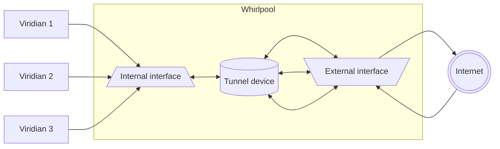

# Caerulean Whirlpool

> Current version: **"0.0.3"**

Whirlpool is "worker" Seaside server node.
It is written in `Go`.
It manages processing, encrypting and transferring VPN packets.
It doesn't manage payments and authentication.

> Target platform: _linux_ only

## Dependencies

1. `go` (compiler) version >= 1.22
  Installation guide can be found [here](https://go.dev/doc/install).
2. `protogo` (`protobuf` compiler automated installer) version >= 0.1.0
  Regularily can be installed with this command: `go install github.com/pseusys/protogo@latest`.
3. System packages: `iptables`, `iproute2`.

## Whirlpool structure

Whirlpool consists of several modules:

- `crypto`: Is responsible for all ciphers, encryption and decryption.
- `generated`: Generated by gRPC, consists of protobuf structures and gRPC server interfaces.
- `sources`: Contains main file and the most high-level server structures and functions.
- `tunnel`: Manages firewall and tunnel device configuration, setup and teardown.
- `users`: Contains viridian and viridian dictionary structures, manages viridian properties and connections.
- `utils`: Consists of utility functions.

## Implementation details

The VPN worker node operates as follows:

1. It creates a [private network](https://en.wikipedia.org/wiki/Private_network) with default address set to "\*.\*.0.1/16".
2. It creates a tunnel device connected to that network with IP equal to the default IP.
3. It sets up firewall policy as follows:
   1. All the local packets are allowed.
   2. All the existing connections are allowed, all SSH connections are allowed.
   3. All UDP packets going to **internal** interface are allowed.
   4. All TCP packets going to **internal** interface to `ctrlport` are allowed.
   5. All ICMP packets going to **internal** interface are allowed.
   6. All the other incoming packets are dropped.
   7. Forwarding is only allowed between tunnel interface and **external** interface.
   8. All packets leaving from **external** interface are MASQUERADEd.
4. It opens gRPC control server on its **internal** interface and waits for users to connect.
5. It also starts listening to the tunnel device: as soon as a packet arrives to it, it gets encrypted and sent to the viridian identified by _the last two bytes_ of the packet source IP.
6. When a viridian connects, a special UDP port assigned to it on **internal** interface, viridian data is added to viridian dictionary identified by this port number and a UDP listener is assigned to this port.
7. When viridian sends encrypted VPN packets to his own port, whirlpool receives them, decrypts, and sets the source address of the packet, so that first two bytes of the IP are first two bytes of the tunnel device network and last two bytes are the same as the viridian port number.
8. Packet is written to tunnel device, gets forwarded to **external** interface, MASQUERADEd and sent to internet.
9. When a response arrives to **external** interface, it gets unmasqueraded and sent to the tunnel network.
10. Since the tunnel device is the only device connected to its network and also has the default IP address, packet gets forwarded to the tunnel device.
11. Finally, response packet gets delivered to viridian by process described in p. 5.
12. Before whirlpool termination, it closes all viridian listeners, removes tunnel device and restores firewall configuration.

> NB! Due to the limitations described above, a whirlpool node can't support more than `2^16 - 3` viridians.
> 2^16 is the number of possible 2 byte number values, also values 0x0000 (network address), 0x0001 (tunnel device address) and 0xFFFF (broadcast address) are not available for viridian authentication.
> Moreover, since some UDP ports of the **internal** interface may already be occupied, the maximum amount of supported viridians might decrease even more.

## Whirlpool diagram



## Whirlpool to surface connection

🚧 Under construction! 🚧

## Configuration and running

Before whirlpool node can be run, the following configuration steps have to be made:

- Disable IPv6 router solicitation (for tunnel interface):
  `echo 0 > /proc/sys/net/ipv6/conf/default/accept_ra`
- Enable IP packet forwarding:
  `echo 1 > /proc/sys/net/ipv4/ip_forward`

### Local whirlpool execution

The executable file can be produced with this command:

```bash
make build [EXECUTABLE_NAME]
```

The executable file can be found under `caerulean/whirlpool/build` root.
It can be run with the following command:

```bash
make run
```

Superuser rights are required for tunnel interface creation.

> NB! If no certificates are present locally, they will be regenerated with `setup` package in "viridian/algae" directory.

### Docker whirlpool execution

Whirlpool can also be launched in Docker, using the following command:

```bash
make run-docker
```

> NB! The docker container will inherit host network properties.

### Whirlpool configuration

> NB! All of the variables below are _required_, there are no defaults provided by the binary itself.
> Meaning, it is expected to use the binary altogether with the "conf.env" variable (it might be generated by the installer).

The whirlpool executable is sensitive to the following environmental variables:

- `SEASIDE_ADDRESS`: **Internal** whirlpool address, should be used for viridians to connect and send VPN packets to, should be _public_.
- `SEASIDE_EXTERNAL`: **External** whirlpool address, will be used to forward viridian packets to outer internet and receive responses, can be _private_ (or same as `SEASIDE_ADDRESS`).
- `SEASIDE_API_PORT`: Control port for gRPC viridian connections.
- `SEASIDE_CERTIFICATE_PATH`: Path for storing logs, two files will be created there: `danger.log` and `safe.log`.
- `SEASIDE_LOG_PATH`: Path for storing certificates, two files should be present there: `cert.crt` and `key.crt`.
- `SEASIDE_PAYLOAD_OWNER`: Authentication payload for node administrators, they have priority in connection limits.
- `SEASIDE_PAYLOAD_VIRIDIAN`: Authentication payload for viridians for direct connection.
- `SEASIDE_MAX_VIRIDIANS`: Maximum amount of viridians (non-privileged) that can be connected simultaneously (should be positive integer or zero).
- `SEASIDE_MAX_ADMINS`: Maximum amount of owners (privileged) that can be connected simultaneously (in addition to normal viridians, should be positive integer or zero).
- `SEASIDE_BURST_LIMIT_MULTIPLIER`: Burst multiplier for all the limits below (should be positive integer).
- `SEASIDE_VPN_DATA_LIMIT`: Limit for VPN packets per viridian per second (should be positive integer, if not - no limit will be applied).
- `SEASIDE_CONTROL_PACKET_LIMIT`: Limit for control packets, packets per viridian per second (should be positive integer, if not - no limit will be applied).
- `SEASIDE_ICMP_PACKET_LIMIT`: Limit for ICMP packets (ping), packets per viridian per second (should be positive integer, if not - no limit will be applied).
- `SEASIDE_TUNNEL_MTU`: Whirlpool internal tunnel MTU number (should be positive integer, if not - will be set same to internal whirlpool address MTU).
- `SEASIDE_TUNNEL_NAME`: Whirlpool internal tunnel interface name (should be an ASCII string, not be longer than 15 characters).
- `SEASIDE_LOG_LEVEL`:  Output verbosity logging level, can be "error", "warning", "info", "debug" (default: `DEBUG`).

Note: connection made _prior_ whirlpool launch will not be interrupted or limited, `SSH` connection (towards port 22) are not limited as well.

> NB! The same variables should be present in the local `conf.env` file in case of Docker execution.

## Other commands

Lint all golang files:

```bash
make lint
```

Test unit tests:

```bash
make test
```

Clean build artifacts:

```bash
make clean
```

There are other commands available, run this to get the full list:

```bash
make help
```

## Test sets

The only tests available are unit tests, for the most important functions of each module.
