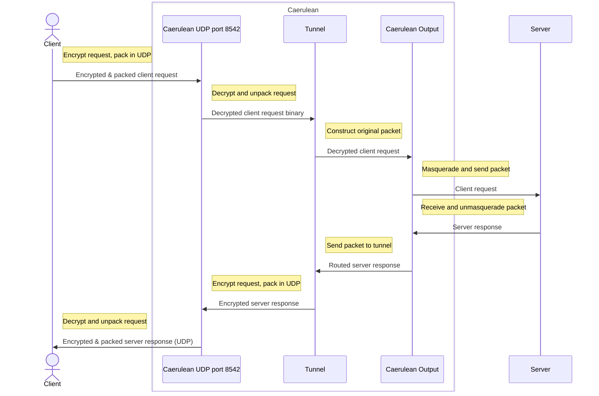

# Caerulean Whirlpool

> Target platform: _linux_ only

Whirlpool program is written in Go language.  
It manages encrypting, decrypting, assembling and transferring requests and responses.

Whirlpool accepts client packages at UDP port 8542, no more than 2000 bytes in size, encrypted.  

Whirlpool sends messages to UDP port 8542, in packets of size 2000, encrypted.

> TODO: update (and check) ports.
> WARNING! Any UDP packets arriving to ports 8542 and 8587 will be treated as user packets, i.e. user should never expect to receive any packets from these ports from any server via Seaside VPN!

## Dependencies

1. `go` (compiler) version >= 1.18
  Installation guide can be found [here](https://go.dev/doc/install).
2. `protobuf` (compiler) version >= 25.1
  Installation guide example can be found [here](https://grpc.io/docs/protoc-installation/#install-pre-compiled-binaries-any-os).
3. `protoc-gen-go` (code generator for golang) version >= 1.25
  Regularily can be installed with this command: `go install google.golang.org/protobuf/cmd/protoc-gen-go@latest`.

## Web API

TODO: automate build (installation script?) + actions + provide list of requirements

TODO: write docstrings + tests + finalize whirlpool before surface

TODO: rewrite control part to http (it's safe), use tokens there, move control to network (partly), split network into parts?

- `/public`
- `/reseed`
- `/stats`
- `/admin`

If key is not updated for 3 consecutive days, node gets disconnected from network and starts updating autonomously.

> WARNING! Same applies for initial network connection.
> If network administrator doesn't approve request for 3 days, the node gets desynchronized.

## Configuration

> Required packages: `iptables`, `ip`

The executable file can be produced with this command:

```bash
make -C caerulean/whirlpool build [EXECUTABLE_NAME=<executable_file_name>]
```

the executable file can be found under `caerulean/whirlpool/build` root.
The executable requires superuser rights to be launched for tunnel interface creation.

It can be run with following arguments:

- `-a <internal_address>` - **internal** IP address: the IP address that will be used to listen to user events (required!).
- `-e <external_address>` - **external** IP address: the IP address that will be used to forward user packets to, most commonly, interntet (default: same as _<internal_address>_).
- `-p <sea_port>` - seaside port: the port that will be used for exchanging data packets with user (default: 8542).
- `-c <control_port>` - control port: the port that will be used for control communication with user (default: 8543).
- `-t <user_time_to_live>` - time after that inactive user record will be deleted from server, in minutes (default: 300).
- `-u <max_user_limit>` - maximum amout of users that can be simultaneously connected to the node (default: 16).

It also sensitive to the following environmental variable:

- `LOG_LEVEL` - the output verbosity level, can be "panic", "fatal", "error", "warning", "info", "debug", "trace" (default: "WARNING").

## Run whirlpool

- Run whirlpool (with default params):

  ```bash
  make -C caerulean/whirlpool run 
  ```

  localhost address will be used for both input and output.

- Lint and format golang files:

  ```bash
  make -C caerulean/whirlpool lint
  ```

- Restore `iptables` configuration after run:

  ```bash
  make -C caerulean/whirlpool restore
  ```

- Clean build artifacts:

  ```bash
  make -C caerulean/whirlpool clean
  ```

## Time diagram


