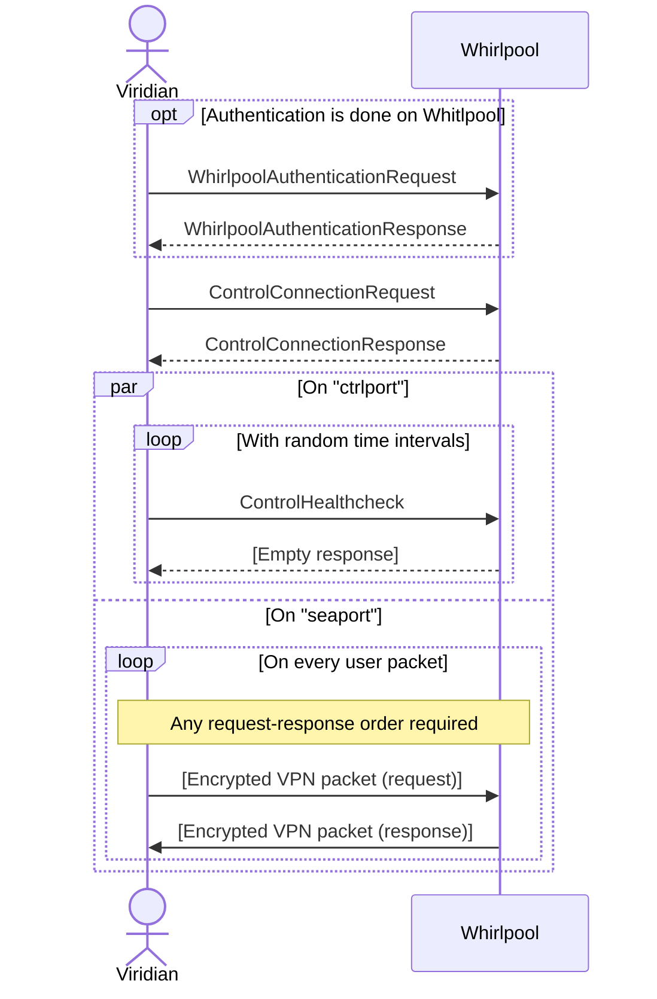

# Viridian

Viridian is a common name for any Seaside VPN client.
There are several viridians available for different platforms and purposes.

## VPN packet encryption

For now, only one algorithm for packet encryption is available, that is `XChaCha20-Poly1305`.

> NB! VPN packets are encrypted and then transmitted via UDP (1 VPN packet = 1 UDP packet).
> That implies that packet size is limited by UDP maximum packet size + encryption overhead.
> UDP packet size limit is 2^16 - 1, encryption nonce is 24 bytes and encryption tag is 16 bytes, that makes maximum VPN packet size equal to 65495 bytes.

## Viridian to whirlpool connection

In this diagram, a typical VPN connection is shown.
All the messages are gRPC encrypted control messages tansmitted through `ctrlport`, except for `VPN packet` messages that are UDP packets transmitted through `seaport`.
Message names reflect corresponding `protobuf` object names (see [message descriptions](./vessels/)).

First, an authentication is performed (with `whirlpool` node directly or with `surface` node).
Viridian sends its credentials and receives a special encrypted authentication token.

Then, connection is performed, viridian sends its token and some metadata to `whilpool`, receiving a dedicated VPN port number.

After that, `ctrlport` is used for periodic healthcheck message exchange.
Healthcheck control messages are sent at random time intervals, losing several healthcheck messages in a row leads to user disconnection.
At the same time, `seaport` can be used to transmit encrypted packets to `whirlpool`.
The packets will be decrypted by `whirlpool` and forwarded to destination.
In case `whirlpool` receives any response, response packets will be encrypted and sent back to `seaport`.

> **NB!** Although the protocol is stateful, the current state is not necessarily important:
> if the current state is lost, viridian can safely re-connect to caerulean _any_ time it wants!

## Viridian to surface connection

🚧 Under construction! 🚧
