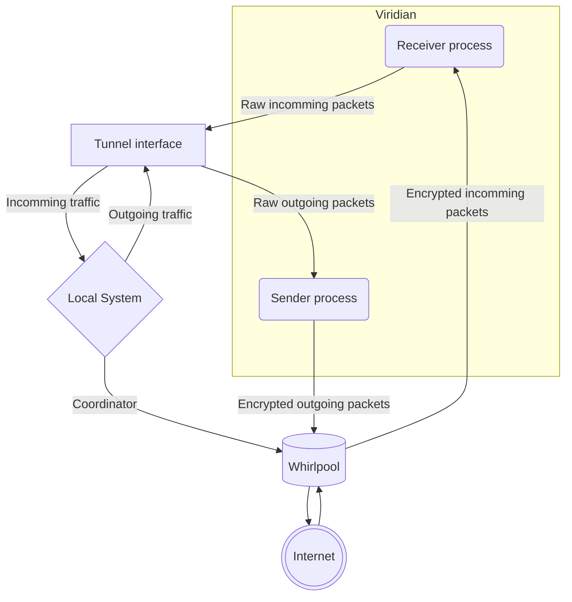
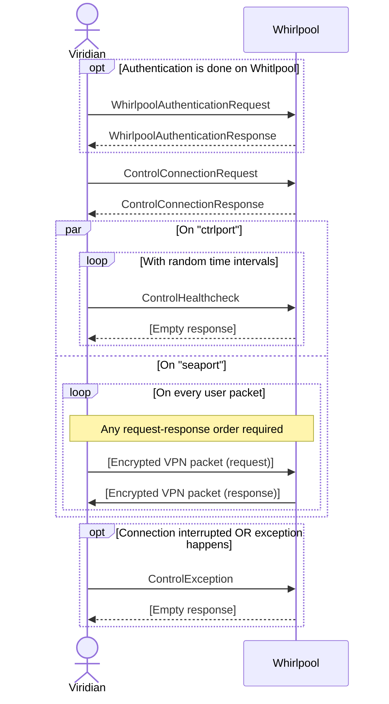

# Viridian

Viridian is a common name for any Whirlpool VPN client.
There are several viridians available for different platforms and purposes.

## Viridian structure

Typical viridian client should consist of the following parts:

- `Coordinator`: establishes all connections, manages `healthcheck` control messages and handles connection exceptions (reconnects, updates token, etc.).
  Also starts and gracefully stops `viridian` and `tunnel`.
- `Viridian`: runs two separate threads/processes/coroutines for sending and receiving encrypted VPN packets to `whirlpool`.
- `Tunnel`: manages all packet tunnelling and firewall rules.

## Viridian idea

The basic idea behind every viridian app is the following:

1. Opens a special UDP VPN port (`seaport` or just `port`).
2. It connects to the caerulean (starts `coordinator` process control message exchange and sends it `seaport` number).
3. It creates a soecial tunnel network interface (`tunnel` part).
4. It backs up built-in firewall setup.
5. It makes a new set of firewall rules:
   1. All the packets going to local networks are allowed.
   2. All the packets going to the viridian IP are allowed.
   3. All the packets going to the `default route` are forwarded to the tunnel interface.
6. It starts `viridian` processes, that do the following:
   1. Listen to the tunnel interface, read packets from there, encrypt them and send to caerulean from `seaport`.
   2. Listen to `seaport`, decrypt any packets coming from it and sends them through the tunnel interface.
7. Sleeps until the connection is interrupted.
8. When the connection should be terminated, `coordinator` sends disconnection request to caerulean.
9. Both `viridian` processes are stopped and terminated.
10. Firewall rules are restored.
11. Tunnel interface is stopped and deleted.

## Viridian diagram

In this diagram common viridian structure is shown.

## VPN packet encryption

For now, only one algorithm for packet encryption is available, that is `XChaCha20-Poly1305`.

> NB! VPN packets are encrypted and then transmitted via UDP (1 VPN packet = 1 UDP packet).
> That implies that packet size is limited by UDP maximum packet size + encryption overhead.
> UDP packet size limit is 2^16 - 1, encryption nonce is 24 bytes and encryption tag is 16 bytes, that makes maximum VPN packet size equal to 65495 bytes.

## Viridian to whirlpool connection

In this diagram, a typical VPN connection is shown.
All the messages are gRPC encrypted control messages tansmitted through `ctrlport`, except for `VPN packet` messages that are UDP packets transmitted through `seaport`.
Message names reflect corresponding `protobuf` object names (see [message descriptions](./vessels/)).

First, an authentication is performed (with `whirlpool` node directly or with `surface` node).
Viridian sends its credentials and receives a special encrypted authentication token.

Then, connection is performed, viridian sends its token and some metadata to `whilpool`, receiving a dedicated VPN port number.

After that, `ctrlport` is used for periodic healthcheck message exchange.
Healthcheck control messages are sent at random time intervals, losing several healthcheck messages in a row leads to user disconnection.
At the same time, `seaport` can be used to transmit encrypted packets to `whirlpool`.
The packets will be decrypted by `whirlpool` and forwarded to destination.
In case `whirlpool` receives any response, response packets will be encrypted and sent back to `seaport`.

If an exception happens on viridian side or it just wants to disconnect, a special message should be sent to `whirlpool` via `ctrlport`.
This behavior is advised, but not necessary: after some time of no activity `viridian` will be disconnected automatically.

> **NB!** Although the protocol is stateful, the current state is not necessarily important:
> if the current state is lost, viridian can safely re-connect to caerulean _any_ time it wants!

## Viridian to surface connection

🚧 Under construction! 🚧
