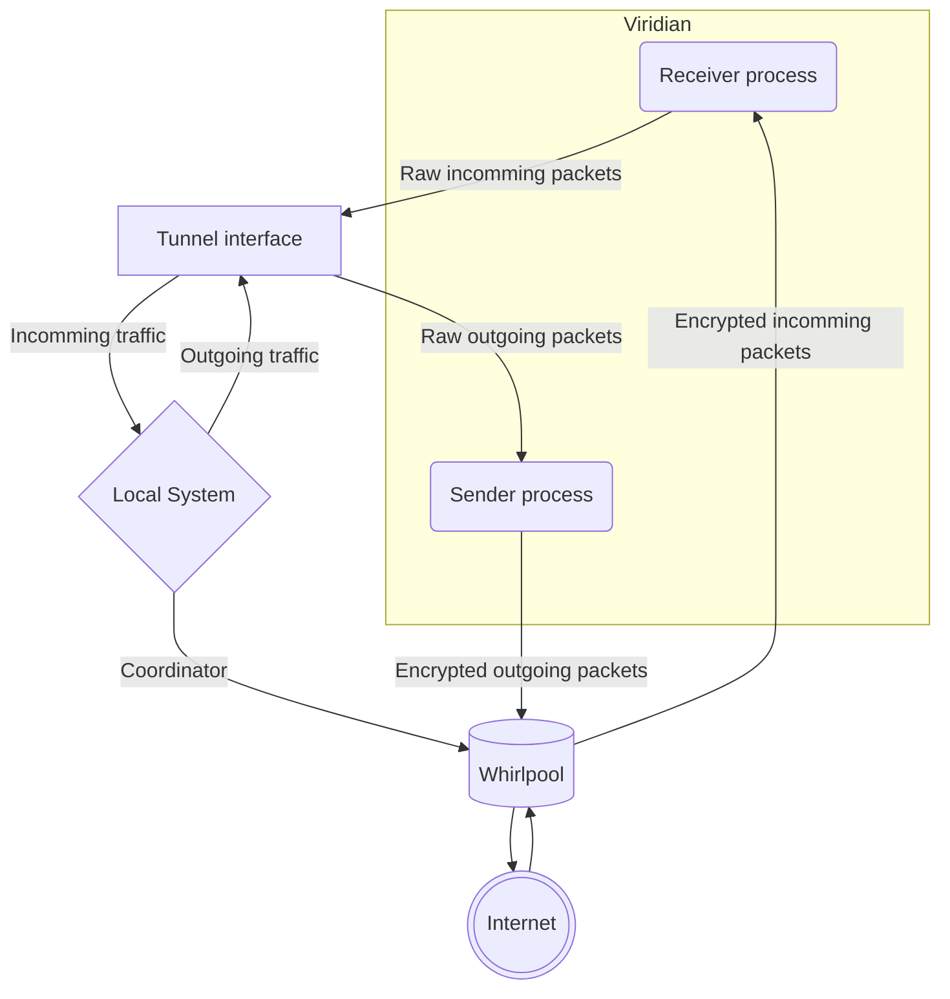

# Viridian Algae

> Current version: **"0.0.3"**

Small CLI-based client application, written in `Python`.
It can be run on linux (in for- and background), it's highly customizable.
Created mainly for development and testing purposes.
Also contains caerulean installation [script](#caerulean-installation-script).

> Target platform: _linux_ only

## Dependencies

1. `python3` (interpreter) version >= 3.10
  Installation guide can be found [here](https://www.python.org/downloads/).
2. `poetry` (build system) version >= 2.0
  Installation guide can be found [here](https://python-poetry.org/docs/#installation).
3. System packages: `iptables`, `iproute2`.

## Implementation details

Viridian algae client consists of the following parts:

- `Coordinator`: establishes all connections, manages `healthcheck` control messages and handles connection exceptions (reconnects, updates token, etc.).
  Also starts and gracefully stops `viridian` and `tunnel`.
- `Viridian`: runs two separate threads/processes/coroutines for sending and receiving encrypted VPN packets to `whirlpool`.
- `Tunnel`: manages all packet tunnelling and firewall rules.

Having logic separated in three independant parts, also not relying on any external libraries, helps testing the protocol and ensuring it works even on the bare metal systems.

## General idea

The basic idea behind viridian algae app is the following:

1. Opens a special UDP VPN port (`seaport` or just `port`).
2. It connects to the caerulean (starts `coordinator` process control message exchange and sends it `seaport` number).
3. It creates a soecial tunnel network interface (`tunnel` part).
4. It backs up built-in firewall setup.
5. It makes a new set of firewall rules:
   1. All the packets going to local networks are allowed.
   2. All the packets going to the viridian IP are allowed.
   3. All the packets going to the `default route` are forwarded to the tunnel interface.
6. It starts `viridian` processes, that do the following:
   1. Listen to the tunnel interface, read packets from there, encrypt them and send to caerulean from `seaport`.
   2. Listen to `seaport`, decrypt any packets coming from it and sends them through the tunnel interface.
7. Sleeps until the connection is interrupted.
8. When the connection should be terminated, both `viridian` processes are stopped and terminated.
9. Firewall rules are restored.
10. Tunnel interface is stopped and deleted.

### Initialization

Upon initialization, the algae `tunnel` finds out the local **default** network interface, i.e. the interface the packets will be forwarded through if no local destination is found.
After that it creates a `TUN` device, sets current user and group as its owner.

Right before the connection, the algae `coordinator` opens gRPC channel to caerulean `whirlpool` and requests token from it.
Then it connects to caerulean `whirlpool`.

Just after the connection, the algae `tunnel` uses `iptables-legacy` firewall to configure traffic.
The following rules are prepended to the existing chains (in order):

1. `iptables -t mangle -A OUTPUT --src [LOCAL_DEFAULT_NETWORK_INTERFACE_IP] -o [LOCAL_DEFAULT_NETWORK_INTERFACE] --dst [CAERULEAN_INTERNAL_IP] -j ACCEPT`
2. `iptables -t mangle -A OUTPUT -o [LOCAL_DEFAULT_NETWORK_INTERFACE] ! --dst [LOCAL_DEFAULT_NETWORK] -j MARK --set-mark 65`
3. `iptables -t mangle -A OUTPUT -o [LOCAL_DEFAULT_NETWORK_INTERFACE] ! --dst [LOCAL_DEFAULT_NETWORK] -j ACCEPT`
4. `... all iptables rules that existed before ...`

... and same rule set for `FORWARD` chain.

After that it sets tunnel device `MTU`, IP address (the IP address is `192.168.0.65`) and changes state to `UP`.
It also cleares routing table #65, sets default route to caerulean internal IP there and sets routing lookup for packets marked with number `65` in table #65.

Finally, the algae `viridian` launches two asyncio coroutines: one for reading packets from tunnel, encrypting them and sending in UDP packets to the specified caerulean `whirlpool` port, and another for reading packets from caerulean `whirlpool`, decrypting them and writing to the tunnel device.

While connection is active, the algae `coordinator` sends healthcheck gRPC messages to caerulean `whirlpool` with random timeouts.
If a non-fatal exception happens, `coordinator` tries to stop algae `viridian` and re-initialize connection, starting from token request, but skipping `tunnel` initialization (since it wasn't stopped).

### Termination

Upon connection interruption (fatal exception or manual), `coordinator` just closes gRPC channel.

Right after that, the algae `tunnel` removes all the `iptables` rules it added (just pops them from the beginning of the tables).
After that it flushes routing table #65, resets routing lookup for packets marked with number `65` and sets tunnel device state to `DOWN`.

> NB! The same cleanup sequence happens if an error before connection is established.

Finally, the algae `tunnel` deletes the tunnel device.

### System diagram



## Configuration and running

All required python dependencies can be installed with this command:

```bash
poetry install --without devel
```

Algae can be executed with following command:

```bash
sudo poetry poe execute [PAYLOAD_VALUE]
```

Superuser rights required for tunnel interface creation.

The following CLI arguments are supported:

- `-a --address [ADDRESS]`: Caerulean server address, to connect to (default: `127.0.0.1`).
- `-c --ctrl-port`: Control port - the port that will be used for control communication with caerulean (default: `8587`).
- `-l --link`: Connection certificate in link form (will overwrite other parameters specified).
- `-h --help`: Print short command notice and exit.
- `-v --version`: Print current algae version and exit.

It also sensitive to the following environmental variable:

- `SEASIDE_TUNNEL_NAME`: Name of the tunnel interface (default: `seatun`).
- `SEASIDE_TUNNEL_ADDRESS`: IP address of the tunnel (default: `192.168.0.65`).
- `SEASIDE_TUNNEL_NETMASK`: Netmask of the tunnel network (default: `255.255.255.0`).
- `SEASIDE_TUNNEL_SVA`: A special constant used for packet marking and routing table setting (default: `65`).
- `SEASIDE_USER_NAME`: User name that will be used during connection (default: `default_algae_user`).
- `SEASIDE_MIN_HC_TIME`: Minimal time between two healthcheck control messages, in seconds (default: `1`).
- `SEASIDE_MAX_HC_TIME`: Maximal time between two healthcheck control messages, in seconds (default: `5`).
- `SEASIDE_CONNECTION_TIMEOUT`: Timeout for gRPC control connection, in seconds (default: `3.0`).
- `SEASIDE_LOG_LEVEL`: Output verbosity logging level, can be "error", "warning", "info", "debug" (default: `DEBUG`).
- `SEASIDE_ROOT_CERTIFICATE_AUTHORITY`: Custom certificate authority file path for whirlpool server.

## Caerulean installation script

Caerulean installation script consists of several python files in `setup` directory.
It can deploy different caerulean server apps on Linux machines with different architectures.
The script itself has no external dependencies, does not require installation or building and can be used as a deployment entrypoint.
It also is not demanding in terms of interpreter version: some reasonably-old `python3` (like `3.8`, available on most of the systems) should be just enough.
The script can be used as-is or compressed for uploading to a remote server using the following command:

```bash
sudo poetry poe bundle [INSTALLATION_SCRIPT_NAME]
```

The script is flexible and accepts multiple different parameters, that will not be described here.
Detailed parameter description can be received by running this command:

```bash
poetry run python3 -m setup --help
```

For each individual caerulean, the options closely resemble the environment variables they depend on.
The option description for each individual caerulean in the following list: (`whirlpool`) can be received by running this command:

```bash
poetry run python3 -m setup CAERULEAN_NAME --help
```

In order to achieve reproducible caerulean deployments, `conf.env` and `certificates` files can be uploaded before deployment.
Combined with relevant script arguments, they will prevent script from regenerating system settings.

> NB! A special case of using the script is generating self-signed certificates set (for local testing or no-DNS deployment).
> It can be done with the following command: `poetry run python3 -m setup --just-certs`.

Examples of this script usage can be found in [whirlpool make](../../caerulean/whirlpool/Makefile) and [Beget deployment script](../../.github/scripts//deploy_whirlpool_beget.mjs).

## Other commands

Lint all python files:

```bash
sudo poetry poe lint
```

Test (all types of tests):

```bash
sudo poetry poe test-all
```

Build standalone executable (OS-specific):

```bash
sudo poetry poe build [EXECUTABLE_NAME]
```

Clean build artifacts:

```bash
sudo poetry poe clean
poetry env remove --all
```

There are other commands available, run this to get the full list:

```bash
sudo poetry poe help
```

## Test sets

Four test sets are included:

1. `unit`: Unit tests for `algae` viridian.
2. `integration`: Integration tests for communication between `algae` viridian and `whirlpool` caerulean.
3. `local`: Smoke test for UDP server access in a chaotic network.
4. `remote`: Smoke test for real-world website access.
5. `domain`: Smoke test for DNS website resolving.
6. `smoke`: All of the `local`, `remote` and `domain` test sets.
7. `all`: All the tests specified.


# TODO!!
1. Add poetry installation requirements to whirlpool and reef
2. Add group configuration descriptions here
3. Change setup struct??
4. Use poetry in scripts (again)?
