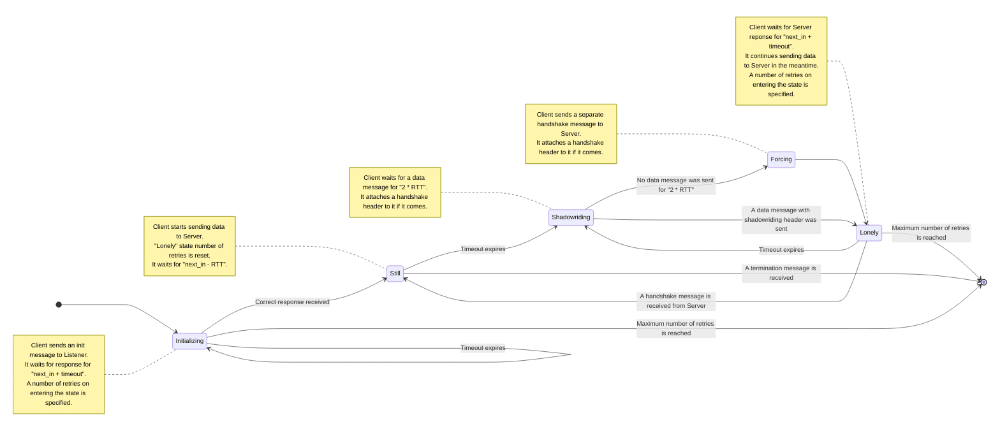
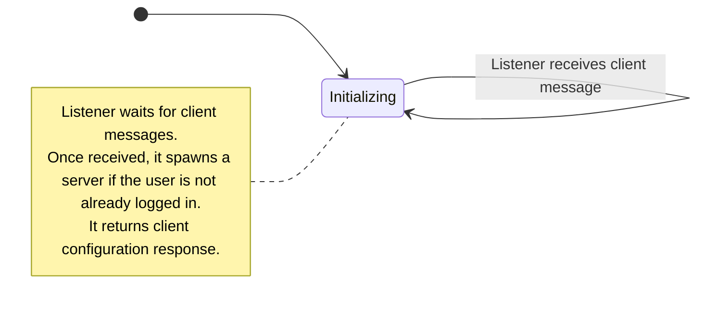
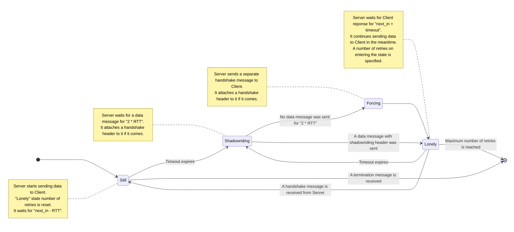

# TYPHOON protocol

> Transfer Your Packets Hidden Over Observed Networks

For a VPN, it is equally important to transfer many packets (`DATA` packets) fast and some packets (keep-alive packets) reliably.
Normally this issue is solved by using 2 distinct connections: 1 UDP data connection and 1 TCP (or QUIC) reliable connection.
However, this approach is no longer relevant in the modern world, where even TLS protocol gets blocked sometimes.
SeasideVPN solves this problem by transferring some authentication to the users via third channels (like email or messengers). 
TYPHOON protocol is designed to replace traditional protocols in the circumstances where presence of this initial data eliminates need for normal handshaking.

## Protocol idea

Three different parties are involved in the protocol:

1. `Client`, a VPN client, uses a UDP port.
2. `Listener`, a server thread for connection, spawns a separate `Server` thread for every connected clients, uses a well-known UDP port.
3. `Server`, a server thread for data exchange, talks to a client, uses a UDP port.

Here's the idea behind the protocol:

1. Client already knows all the information required for connection, including:
  - `Listener` port and address.
  - Authentication token.
  - Asymmetric key.
2. `Client` sends a UDP connection message to the `Listener`, it performs some configuration, spawns `Server` and sends a response message back to `Client`.
3. `Client` starts sending VPN data to the `Server`, from time to time it also sends keep-alive (handshake) messages:
  - If there is some data flowing, these messages are just appended to the data messages (this is called `shadowride`).
  - If the client stays silent for a while, separate handshake messages are sent.
4. One of the parties can optionally send a termination message to interrupt connection (otherwise it will just timeout once either client or server goes offline).

## Encryption and authentication

The initialization message (the one being sent from client to listener) is encrypted using asymmetric [ECIES](https://en.wikipedia.org/wiki/Integrated_Encryption_Scheme)-like algorithm.
All the other messages (and also the initialization message) payload are encrypted using one of the two supported ciphersuites: [XChaCha-Poly1305](https://en.wikipedia.org/wiki/ChaCha20-Poly1305).
The algorithms are defined in the [Monocypher](https://monocypher.org/) library.

Each user uses the same asymmetric key and private symmetric key.
Since all the messages are **completely** encrypted, the only way server could attribute a message with a user key is using distinct ports for every user.
That is why a separate `Server` thread is provided for every user connected to the server.

## Recognition protection

Since all the messages are completely encrypted (or consist of random parts), the protocol should provide suffient protection from packet analysis.
However, there are some other metadata that is important to hide, including time and size metadata.
That is how the protocol addresses the challenges:

- In order not to provide much time metadata, lots of random delays are included between message exchanges.  
  NB! For `Server`, message processing time should be **included** into these delays.
- Also a byte tail of random sze is appended to every message.

## Packet structure

Several different message types of the protocol serve different purposes:

- The first initial message (request and response, sent from a `Client` to `Listener` and back) is called `INIT` message.
- The handshake (keep-alive) message (request and response, sent from a `Client` to `Server` and back) is called `HDSK` message.  
  NB! A special case of `HDSK` message (`shadowride`) is sent along with `DATA` message in one packet.
- The data (VPN) message (request and response, sent from a `Client` to `Server` and back) is called `DATA` message.
- The termination message (request and response, sent from a `Client` to `Server` or back) is called `TERM` message.

The type of message is defined by the first field, `Flags`.
This field is 1 byte long and has the following binary meaning:

| Message type | Flag value |
|---|:---:|
| `INIT` | `128` |
| `HDSK` | `64` |
| `DATA` | `32` |
| `TERM` | `16` |

The different protocol message types have different header structure:

### Client `INIT`

| Field name | Byte length | Field description |
|---|:---:|---|
| Flags | `1` | Message flags |
| Packet number | `2` | Unique number of the packet |
| Client name | `16` | Client application name (may include version) |
| Next in | `2` | A random delay until server answer will be expected |
| Tail length | `2` | A random tail length that will be appended to the message |
| Token | variable | User authentication payload |
| Tail | variable | Random length tail |

### Server `INIT`

| Field name | Byte length | Field description |
|---|:---:|---|
| Flags | `1` | Message flags |
| Packet number | `2` | Unique number of the packet |
| User ID | `2` | The port number of the spawned `Server` |
| Next in | `2` | A random delay until the first handshake |
| Tail length | `2` | A random tail length that will be appended to the message |
| Tail | variable | Random length tail |

### Server and server `HDSK`

| Field name | Byte length | Field description |
|---|:---:|---|
| Flags | `1` | Message flags |
| Packet number | `2` | Unique number of the packet |
| Next in | `2` | A random delay until the next handshake or server answer |
| Tail length | `2` | A random tail length that will be appended to the message |
| Data | optional | Optional message data payload of variable length |
| Tail | variable | Random length tail |

### Client and server `DATA`

| Field name | Byte length | Field description |
|---|:---:|---|
| Flags | `1` | Message flags |
| Tail length | `2` | A random tail length that will be appended to the message |
| Data | optional | Optional message data payload of variable length |
| Tail | variable | Random length tail |

### Client and server `TERM`

| Field name | Byte length | Field description |
|---|:---:|---|
| Flags | `1` | Message flags |
| Tail length | `2` | A random tail length that will be appended to the message |
| Tail | variable | Random length tail |

## State machine

Typhoon protocol can be described as state machines:

### `Client` state machine

### `Listener` state machine

### `Server` state machine

## Some common values calculations

Some of the values mentioned above have special constraints on their calculation:

### Global constants

| Constant name | Default value |
|---|:---:|
| `ALPHA` | `0.125` |
| `BETA` | `0.25` |
| `MIN_RTT` | `1.0` |
| `MAX_RTT` | `8.0` |
| `MIN_TIMEOUT` | `4.0` |
| `MAX_TIMEOUT` | `32.0` |
| `DEFAULT_TIMEOUT` | `30.0` |
| `MAX_TAIL_LENGTH` | `1024` |
| `MIN_NEXT_IN` | `64.0` |
| `MAX_NEXT_IN` | `256.0` |
| `MAX_RETRIES` | `5` |

### RTTs calculation

RTT is calculated using [EWMA](https://en.wikipedia.org/wiki/Moving_average#Exponential_moving_average) algorithm.
However, since `INIT` packet is only send once and `DATA`-only packets are not tracked and have shortened header, only `HDSK` packets are used for RTT calculation.
It is also important to substract the `next_in` random delay from the resulting packet RTT on every step.
Global variables `ALPHA` and `BETA` are used for RTT calculations.

Several bounds are implemented for both RTT and timeout values (when they are used in practice).
RTT should be between `MIN_RTT` and `MAX_RTT`, timeout should be between `MIN_TIMEOUT` and `MAX_TIMEOUT`, the default value can be set to `DEFAULT_TIMEOUT`.

### Common random values

Here are some notes on generation of some random values:

- Packet number (part of the `INIT` and `HDSK` packet): calculated as current timestamp modulo $2^{32}$ (2 bytes).  
  It should be unique, although it is not advanced by 1, but derived from current time instead and helps both `Client` and `Server` to calculate RTT.
- Random tail length: tail length can be any number between `0` and `MAX_TAIL_LENGTH`.
- Next in: should be greater than timeout value, that's it; can be any number between `MIN_NEXT_IN` and `MAX_NEXT_IN`.
- Retries: number of retries should not be that large, the default one can be used directly: `MAX_RETRIES`.

## Side notes

1. The protocol can't be overwhelmed by numerous `INIT` messages sent to listener.  
  Since the authentication token defines user uniquely, no new server will be spawner for an already authenticated user.
2. If an out-of-order packet (or just any unexpected packet) arrives to any of the actors, it is silently dropped.  
  At one point in time, only one `INIT` or `HDSK` message is expected.
3. In general `HDSK` messages should be **rare**, there is no need to perform healthchecks often.  
  That is why setting next in values not within the default constants is not advised.
