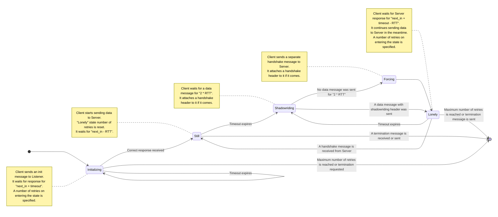
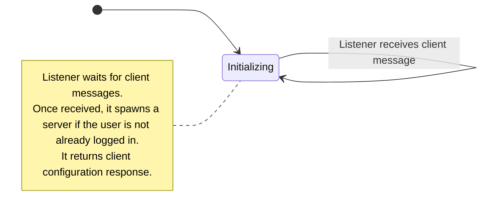
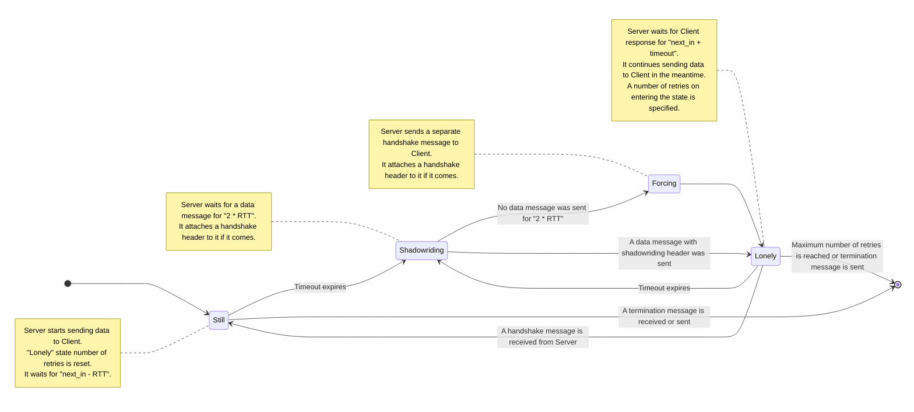

# TYPHOON protocol

> Transfer Your Packets Hidden Over Observed Networks

For a VPN, it is equally important to transfer many packets (`DATA` packets) fast and some packets (keep-alive packets) reliably.
Normally this issue is solved by using 2 distinct connections: 1 UDP data connection and 1 TCP (or QUIC) reliable connection.
However, this approach is no longer relevant in the modern world, where even TLS protocol gets blocked sometimes.
Seaside VPN solves this problem by transferring some authentication to the users via third channels (like email or messengers).
TYPHOON protocol is designed to replace traditional protocols in the circumstances where presence of this initial data eliminates need for normal handshaking.

In general, it the protocol is based on UDP and most of its packets are just UDP packets with a minimal header and random tail.
In addition to that, it ensures connection is healthy (somewhat close to TCP keepalive but with random interval).
The healthcheck handshake messages are either sent empty or appended to data packets (shadowriding).
The protocol ensures reliable transportation of these handshake headers, and also defines a TCP-style reliable 2.5-step handshake.

## Protocol idea

Three different parties are involved in the protocol:

1. `Client`, a VPN client, uses a UDP port.
2. `Listener`, a server thread for connection, spawns a separate `Server` thread for every connected clients, uses a well-known UDP port.
3. `Server`, a server thread for data exchange, talks to a client, uses a UDP port.

Here's the idea behind the protocol:

1. Client already knows all the information required for connection, including:
   - `Listener` port and address.
   - Authentication token.
   - Asymmetric key (and obfuscation key).
2. `Client` sends a UDP connection message to the `Listener`, it performs some configuration, spawns `Server` and sends a response message back to `Client`.
3. `Client` starts sending VPN data to the `Server`, from time to time it also sends keep-alive (handshake) messages:
   - If there is some data flowing, these messages are just appended to the data messages (this is called **shadowriding**).
   - If the client stays silent for a while, separate empty handshake messages are sent.
4. One of the parties can optionally send a termination message to interrupt connection (otherwise it will just timeout once either client or server goes offline).

## Protocol initialization

Protocol is initialized with a 2.5-step handshake, almost like TCP.
The difference is that the server allows client to send data packets even before it receives the final (3rd) control packet.
That is, client can start sending VPN traffic to the server right after it has received its response (the 2nd control message).
Also the random timeout between the two first control messages is reduced (typically 20 times comparing to the normal timeout).

## Encryption and authentication

It is well-known that generally implementing custom cryptography [is a bad idea](https://www.reddit.com/r/programming/comments/yaplf2/dont_roll_your_own_crypto/).
Still, for one specific scenario here (protocol initialization) it was decided not to rely on any existing algorithm.
Technically, [ECIES](https://en.wikipedia.org/wiki/Integrated_Encryption_Scheme) would be the right solution for the initialization message (the one being sent from client to listener), but ECIES does not hide the ephemeral key and (since it has a predictable structure) it can be easily detected.
That is why a custom obfuscation technique is used: the ephemeral key is XORed with the hash of the obfuscation key (that is the part of the server private key) and two leading bytes of the initialization message.
This technique allows the initialization message to look completely random.
It is also becomes hard to verify if a given message belongs to TYPHOON protocol (unlike it is with [Elligator](https://elligator.org/)).

All the other messages (and also the initialization message) payload are encrypted using [XChaCha-Poly1305](https://en.wikipedia.org/wiki/ChaCha20-Poly1305) symmetric cipher.
[Monocypher](https://monocypher.org/) library is used normally for both of the algorithms (however, both `Client` and `Server` can use any other faster implementation of XChaCha20-Ploy1305).

Each user uses common asymmetric key and private symmetric key.
Since all the messages are **completely** encrypted, the only way server could attribute a message with a user key is using distinct ports for every user.
That is why a separate `Server` thread is provided for every user connected to the server.

## Reliable packet order

The protocol is designed so that it naturally avoids packet duplications and desynchronization.
It is effectively stateless on server side, meaning that every new incoming packet resets the server state.
Since the server does not have a strong inner state, the client can always enforces its own state, meaning that any out of order or unexpected packet will be just ignored.

In case the correct response waiting delay is long enough and the retry number is sufficient, that eliminates the need for complex recovery behavior and state management.
The single important rule is that the control packets should always be processed synchronously (or behind a mutex).

## Recognition protection

Since all the messages are completely encrypted (or consist of random parts), the protocol should provide sufficient protection from packet analysis.
However, there are some other metadata that is important to hide, including time and size metadata.
That is how the protocol addresses the challenges:

- In order not to provide much time metadata, lots of random delays are included between message exchanges.  
  NB! For `Server`, message processing time should be **included** into these delays.
- Also a byte tail of random sze is appended to every message.

## Packet structure

Several different message types of the protocol serve different purposes:

- The first initial message (request and response, sent from a `Client` to `Listener` and back) is called `INIT` message.
- The handshake (keep-alive) message (request and response, sent from a `Client` to `Server` and back) is called `HDSK` message.  
  NB! A special case of `HDSK` message (`shadowride`) is sent along with `DATA` message in one packet.
- The data (VPN) message (request and response, sent from a `Client` to `Server` and back) is called `DATA` message.
- The termination message (request and response, sent from a `Client` to `Server` or back) is called `TERM` message.

The different protocol message types have different header structure:

### Client `INIT`

| Field name | Byte length | Field description |
|---|:---:|---|
| Flags | `1` | Message flags |
| Packet number | `2` | Unique number of the packet |
| Client type | `1` | Client application type, 0 for unknown or custom client |
| Client version | `1` | Client application major version, used for compatibility checks |
| Next in | `2` | A random delay until server answer will be expected |
| Tail length | `2` | A random tail length that will be appended to the message |
| Token | variable | User authentication payload |
| Tail | variable | Random length tail |

### Server `INIT`

| Field name | Byte length | Field description |
|---|:---:|---|
| Flags | `1` | Message flags |
| Packet number | `2` | Unique number of the packet |
| Return code | `1` | Initialization return code |
| User ID | `2` | The port number of the spawned `Server` |
| Next in | `2` | A random delay until the first handshake |
| Tail length | `2` | A random tail length that will be appended to the message |
| Tail | variable | Random length tail |

### Client and server `HDSK`

| Field name | Byte length | Field description |
|---|:---:|---|
| Flags | `1` | Message flags |
| Packet number | `2` | Unique number of the packet |
| Next in | `2` | A random delay until the next handshake or server answer |
| Tail length | `2` | A random tail length that will be appended to the message |
| Data | optional | Optional message data payload of variable length |
| Tail | variable | Random length tail |

### Client and server `DATA`

| Field name | Byte length | Field description |
|---|:---:|---|
| Flags | `1` | Message flags |
| Tail length | `2` | A random tail length that will be appended to the message |
| Data | optional | Optional message data payload of variable length |
| Tail | variable | Random length tail |

### Client and server `TERM`

| Field name | Byte length | Field description |
|---|:---:|---|
| Flags | `1` | Message flags |
| Tail length | `2` | A random tail length that will be appended to the message |
| Tail | variable | Random length tail |

## Special field values

The type of message is defined by the first field, `Flags`.
This field is 1 byte long and has the following binary meaning (the other bits are reserved for future use):

| Message type | Flag value |
|---|:---:|
| `INIT` | `128` |
| `HDSK` | `64` |
| `DATA` | `32` |
| `TERM` | `16` |

If an error happens during handshake (e.g. unexpected packet number), the packet is silently ignored.
If an error occurs during initialization process, it is reflected in the special `Return code` field:

| Error code | Field value |
|---|:---:|
| `Success` | `0` |
| `Toking parsing error` | `1` |
| `Connection error` | `2` |
| `Registration error` | `3` |
| `Unknown error` | `4` |

Finally, if any other outer circumstances require any communication party to stop communication, a `TERM` packet should be sent.

## State machine

Typhoon protocol can be described as state machines:

### `Client` state machine

### `Listener` state machine

### `Server` state machine

## Some common values calculations

Some of the values mentioned above have special constraints on their calculation:

### Global constants

The constants are described in [an environment file](./example.conf.env).
There, TYPHOON-related constants are prefixed with `TYPHOON_`, but they will be referred just by name later in this file.
The constants can be overridden by setting environment variables (just like the environment file in question does), but in most cases they shouldn't be.

### RTTs calculation

RTT is calculated using [EWMA](https://en.wikipedia.org/wiki/Moving_average#Exponential_moving_average) algorithm.
However, since `INIT` packet is only send once and `DATA`-only packets are not tracked and have shortened header, only `HDSK` packets are used for RTT calculation.
It is also important to subtract the `next_in` random delay from the resulting packet RTT on every step.
Global variables `ALPHA` and `BETA` are used for RTT calculations.
Timeout will be calculated as smooth RTT + RTT variance * `RTT_MULT`.

The RTT value should be updated upon receiving a `HDSK` packet.
The packet RTT can be calculated using this formula: `PacketReceiveTimestamp - PacketSendTimestamp - RequestNextIn`.

Several bounds are implemented for both RTT and timeout values (when they are used in practice).
RTT should be between `MIN_RTT` and `MAX_RTT`, the default value can be set to `DEFAULT_RTT`.
Timeout should be between `MIN_TIMEOUT` and `MAX_TIMEOUT`, the default value can be set to `DEFAULT_TIMEOUT`.

### Common random values

Here are some notes on generation of some random values:

- Packet number (part of the `INIT` and `HDSK` packet): calculated as current timestamp modulo $2^{32}$ (2 bytes).  
  It should be unique, although it is not advanced by 1, but derived from current time instead and helps both `Client` and `Server` to calculate RTT.
  It will reset once per approximately 18 hours, which is perfectly fine, since normally RTT will never be even close to this time.
- Random tail length: tail length can be any number between `0` and `MAX_TAIL_LENGTH`.
- Next in: normally it should be greater than timeout value, that's it; can be any number between `MIN_NEXT_IN` and `MAX_NEXT_IN`.
  The initial next in value should be shorter (otherwise connection would take ages), so the initial `MIN_NEXT_IN` and `MAX_NEXT_IN` would be multiplied by special `INITIAL_NEXT_IN` multiplier (so that it will be effectively reduced).
- Retries: number of retries should not be that large, the default one can be used directly: `MAX_RETRIES`.

## Side notes

1. The protocol can't be overwhelmed by numerous `INIT` messages sent to listener.  
  Since the authentication token defines user uniquely, no new server will be spawned for an already authenticated user.
2. If an out-of-order packet (or just any unexpected packet) arrives to any of the actors, it is silently dropped.  
  At one point in time, only one `INIT` or `HDSK` message is expected.
3. In general `HDSK` messages should be **rare**, there is no need to perform healthchecks often.  
  That is why setting next in values not within the default constants is not advised.
4. However, it is important for server to limit `next_in` values received from user to some reasonable delay.
  Otherwise the server might end up polluted with lots of waiting-forever `Servers`.
