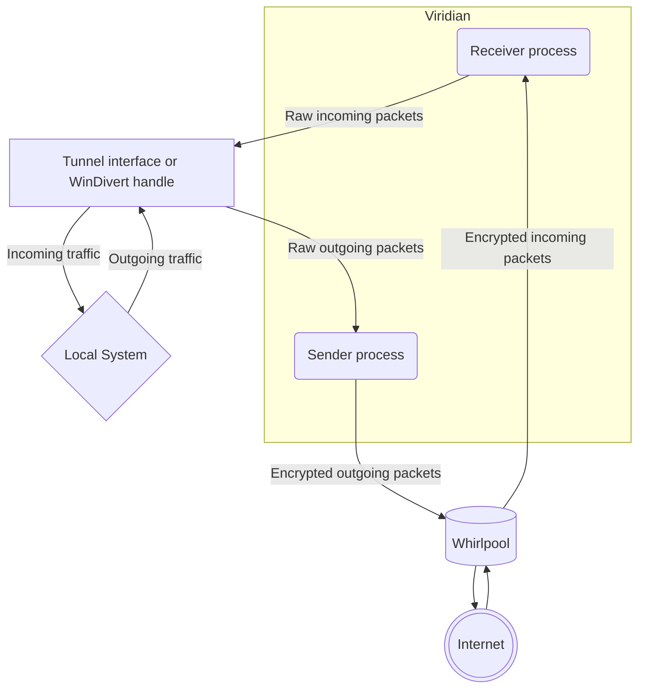

# Reef

> Current version: **"0.0.3"**

Reef is a standalone cross-platform VPN client, written in rust.
It specifically does not integrate with any built-in VPN interfaces or network connection managers.
Moreover, it contains a common Seaside library, that can be used on other platforms, combined with some platform-specific code.

> Target platforms of executable: _linux_, _windows_  
> Target platforms of library: _linux_, _windows_, _macOS_, _android_, _iOS_

## Implementation details

Viridian reef client consists of the following parts:

- **Front-end**: contains the CLI, API, option parsing and validation.
- **VPN head**: highly platform-specific code, responsible for capturing outbound packets from the network stack according to the defined filter and inserting the inbound packets.
- **Back-end**: set of highly-efficient tools for processing and encryption of captured packets, focusing on performance, thread safety and making zero copies.
- **VPN tail**: implementation of Seaside protocol client parts, responsible for connection and communication to a remote server.

Inside of a reef executable itself, all of the parts described above can be found working together.
Still, the modular structure allows reusing some of them in different scenarios and on other platforms.

That is why, the **back-end** and **VPN tail** together form the reef library, that is reused in other client apps.
The other apps, in turn, have to define their own **front-end** (either CLI or GUI or both) and **VPN head** (which is normally a built-in system interface for VPN creation).
They can also optionally either wrap the reef library into another object, conforming to the target platform architecture, or just use it as-is if linking with rust library is directly supported.

> NB! All the tests and executables were only build for Intel/AMD x64 architecture.
> There is no ARM executable primarily because there are [no ARM artifacts](https://github.com/basil00/WinDivert/issues/379) for WinDivert.

## General idea

The basic idea behind viridian reef app is the following:

1. Parse and validate the arguments.
2. Back up current system network settings (if needed).
3. Establish packet capturing with **front end** using a fine-grained filter, and forwarding them to a "tunnel".
4. Initialize one of the Seaside protocol client, connect to a remote server and authenticate.
5. Set up two worker tasks:
   1. Extract packets from tunnel, process them with **back end** and send to the server.
   2. Receive packets from server, process them with **back end** and inject into the tunnel.
6. Sleep until either connection is interrupted manually or the specified command terminates.
7. Stop and clean all the worker tasks.
8. Restore system network settings (if backed up).

### System integration

The most system-dependant part of reef is its **VPN head**, while the rest are mostly written in platform-independent manner.

On linux the head is implemented using fine-grained packet filtering and double forwarding.
For that, first the packets are "marked" with `iptables` rules and then they are routed by a specific routing table, which sends them to a TUN interface.
Reef client captures all the packets from the interface and sends them to the server (that is why it's important to configure your system so that it doesn't send any random packets to the newly-created interfaces).
When a server response needs to be injected into the network stack, it is again written to the tunnel interface, so that it appears as it has been received from outside.

On Windows the head heavily relies on `WinDivert` library.
The packets are captured according to a filter string and they are received by the reef executable directly.
Same for the packet injection, `WinDivert` handles that.

On the other platforms, it is _impossible_ to create a VPN client that would not be integrated with any system interfaces, so that is out of scope of reef client, that is meant to be standalone.

### System diagram



## Use and run

Take care before you use the standalone reef app.
It is mostly intended to be used with servers, virtual machines and other non-user oriented devices.
Still, if you have chosen to thread this path, here are some hints (but still, prepare to experiment and explore it on your own).

### Linux

Linux executable is self-contained and relies on system packages only.
It is advisable to pair it with an environment file, defining all the variables you would like to use (see [sample environment file](./example.conf.env) and [protocol environment file](../algae/typhoon/example.conf.env)).
The launch command in that case will be something like this:

```shell
sudo sh -c ". my-env-file.env && reef.run ..."
```

It is possible to set up reef on a routing device, in that case all the packets being routed should be processed by the Seaside routing table, either manually or automatically.
Imagine you would like process all the packets incoming to a local interface `INPUT_INTERFACE`.
Considering your `SVR` code is `SVR_CODE`, probably you will need to add an `iptables` rule for that, something like this:

```shell
iptables -t mangle -I INPUT 1 -i <INPUT_INTERFACE> -j ACCEPT
iptables -t mangle -I INPUT 1 -i <INPUT_INTERFACE> -j MARK --set-mark <SVR_CODE>
```

### Windows

Running reef on Windows is not as easy as for Linux.

First of all, the executable depends on `WinDivert` shared library.
This library file should be retrieved from the [`WinDivert` official release page](https://github.com/basil00/WinDivert/releases), getting the version number from the [`Makefile`](./Makefile) (`WINDIVERT_VERSION` constant).
The release archive should be unpacked, the library file in question can be retrieved either from `x64` or `x32` directory (depending on your architecture), it should have `.DLL` extension.
The file should be placed to the same directory as reef executable.

Finally, Windows does not have a native support for environment files and managing them manually is not at all convenient, so it can be advisable to use a `CMD` script for setting up the environment and running the binary.
Again, see [sample environment file](./example.conf.env) and [protocol environment file](../algae/typhoon/example.conf.env) to get an idea of possible configuration options.
The script could look somewhat like this:

```bat
set CONNECTION_LINK=...

[All the other environment variable configurations...]

start "" ".\reef.exe -l %CONNECTION_LINK% ..."
pause
```

This script should run in Windows `cmd` app, launched on behalf of an administrator.
